# Técnicas de NLP em Dados do Instagram

[](https://github.com/Vini0606/Tecnicas-de-Ciencia-de-Dados-em-dados-do-Instagram/actions/workflows/python-app.yml)


**Autor:** Vinícius de Paula R. Carvalho
**Trabalho de Conclusão de Curso** — Ciência de Dados e Inteligência Artificial, IESB

Este repositório é a implementação completa de um TCC que **propõe e valida uma metodologia híbrida de Processamento de Linguagem Natural**: em vez de aplicar análise de sentimentos, modelagem de tópicos e clusterização isoladamente, o trabalho as integra e demonstra que a combinação revela o que nenhuma delas mostra sozinha. O estudo de caso são os perfis de Instagram dos **27 governadores do Brasil**.

O achado central, em uma frase: **o conteúdo padrão é aprovado, o viral é debatido, e o longo é ignorado.** Nenhuma das três técnicas, isolada, chega a essa conclusão.

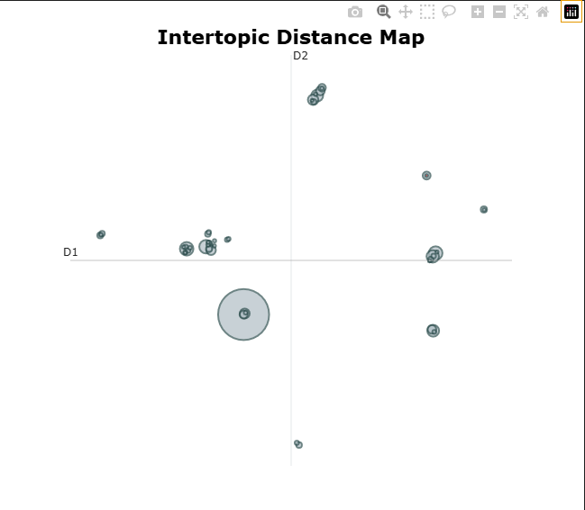

<sup>Mapa de distância intertópica dos 50 temas identificados por BERTopic no corpus de comentários. Círculos próximos são semanticamente similares; o tamanho é proporcional à frequência do tópico.</sup>

---

## Sumário

1. [Contexto da pesquisa](#1-contexto-da-pesquisa)
2. [Metodologia híbrida e resultados](#2-metodologia-híbrida-e-resultados)
3. [Arquitetura de dados](#3-arquitetura-de-dados)
4. [Estrutura do repositório](#4-estrutura-do-repositório)
5. [Como executar](#5-como-executar)
6. [Estado atual e limitações conhecidas](#6-estado-atual-e-limitações-conhecidas)
7. [Testes e CI](#7-testes-e-ci)
8. [Dependências e referências](#8-dependências-e-referências)

---

## 1. Contexto da pesquisa

### O problema

As mídias sociais se consolidaram como plataformas centrais na formação da opinião pública, mas o volume e a natureza não estruturada dos comentários tornam a análise manual impraticável. A lacuna que este trabalho ataca não é a falta de ferramentas — é o fato de que as abordagens tradicionais aplicam essas ferramentas **isoladamente**. Medir apenas a polaridade do sentimento não diz *sobre o quê* o público reage; extrair apenas tópicos não diz *como* o público reage; agrupar apenas por métricas não diz *nada* sobre conteúdo.

### A hipótese

A integração sinérgica de análise de sentimentos, modelagem de tópicos e clusterização produz uma leitura da percepção pública mais granular do que a soma das partes.

### Objetivo geral

> Desenvolver e validar uma metodologia de modelagem híbrida baseada em Processamento de Linguagem Natural que combine análise de sentimentos, modelagem de tópicos e técnicas de clusterização para análise de publicações e comentários de redes sociais.

### Objetivos específicos

1. Estruturar um pipeline de processamento de dados textuais (limpeza, normalização, preparação)
2. Aplicar análise de sentimentos para identificar polaridades
3. Implementar modelagem de tópicos para extrair os temas discutidos
4. Aplicar clusterização para agrupar publicações por semelhança
5. Validar em estudo de caso real — os governadores do Brasil
6. **Comparar com abordagens isoladas**, evidenciando as vantagens da integração

O objetivo nº 6 é o que diferencia o trabalho: não basta aplicar as três técnicas, é preciso provar que juntas valem mais.

### O corpus

| Dimensão | Volume |
|---|---|
| Perfis de governadores | 27 (todos verificados e públicos) |
| Posts do feed | 810 |
| Reels | 810 |
| Comentários coletados | ~13.500 (6.777 em reels + 6.749 em posts) |

Coleta via [Apify](https://apify.com), a partir da lista curada em `data/raw/governadores.xlsx`.

### Por que engenharia de dados em um TCC de NLP

Esta é uma decisão de projeto deliberada, não excesso de escopo. Um resultado acadêmico precisa ser **reproduzível**: qualquer número citado no texto do TCC deve poder ser recuperado meses depois, exatamente como estava. Um pipeline que sobrescreve arquivos Excel não oferece isso.

A arquitetura Medallion sobre Delta Lake resolve o problema com três garantias:

- **Time travel** — `DeltaRepository(as_of_version=…)` recupera o estado exato dos dados de qualquer execução anterior
- **Linhagem** — todo registro carrega `_run_id`, `_ingested_at` e `_source_layer`, permitindo rastrear um número até a coleta que o produziu
- **Contratos de schema** — `src/schemas_delta.py` declara os tipos de cada camada, com `nullable=False` nas camadas Silver e Gold como validação *fail-fast*

---

## 2. Metodologia híbrida e resultados

As quatro técnicas são aplicadas em sequência, cada uma alimentando a seguinte. Os resultados abaixo estão documentados em `reports/academic/Capítulos/Capitulo_05_Modelagem.tex`.

### 2.1 PCA — redução dimensional

As métricas numéricas dos reels foram reduzidas a dois componentes que retêm **92% da variância**:

| Componente | Variância | Interpretação | Carga dominante |
|---|---|---|---|
| PC1 | 67% | Índice de Engajamento | `likesCount` 0.59 · `videoPlayCount` 0.57 · `commentsCount` 0.56 |
| PC2 | 25% | Fator de Duração | `videoDuration` 1.00 |

A separação é limpa: PC1 mede repercussão, PC2 mede duração, e um não contamina o outro. Isso torna a clusterização subsequente interpretável.

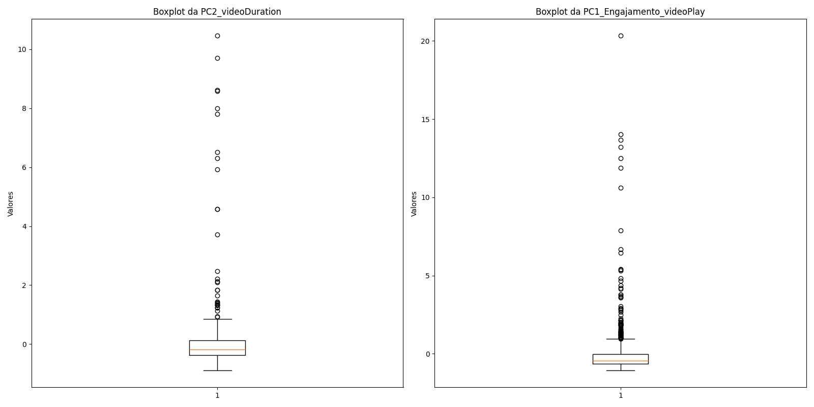

<sup>Distribuição de PC1 (Engajamento) e PC2 (Duração). A longa cauda de outliers positivos em ambos é o que justifica escolher, na etapa seguinte, um algoritmo robusto a outliers.</sup>

### 2.2 Clusterização automática — `AutoClusterHPO`

`src/modeling/clustering.py` é a peça original do trabalho. Em vez de arbitrar o número de clusters, ele conduz uma busca automatizada:

- Testa **KMeans, DBSCAN e Agglomerative Clustering**, cada um com seu próprio espaço de hiperparâmetros
- Otimiza via **TPE (Hyperopt)**, 50 avaliações por algoritmo
- Avalia com um **score CVI combinado** — Silhouette + Calinski-Harabasz normalizado por `tanh(chi/10000)` + Davies-Bouldin invertido por `tanh(1/dbi)` ([`clustering.py:77-88`](src/modeling/clustering.py))
- Filtra os pontos de ruído do DBSCAN antes de calcular os índices, evitando a distorção que invalidaria a comparação entre algoritmos

**Resultado:** o framework elegeu **DBSCAN** (`eps=1.40`, `min_samples=5`) com score CVI combinado de **0.6594**, encontrando três grupos:

| Cluster | Reels | Perfil | Duração média |
|---|---|---|---|
| **0** — Padrão | 792 | Engajamento moderado e consistente | 64,5 s |
| **-1** — Viral | 12 | ~4.843 comentários, ~90k curtidas, 1,12M views | 26–900 s |
| **1** — Longo / Baixa performance | 6 | Pior desempenho em todas as métricas | 721 s (~12 min) |

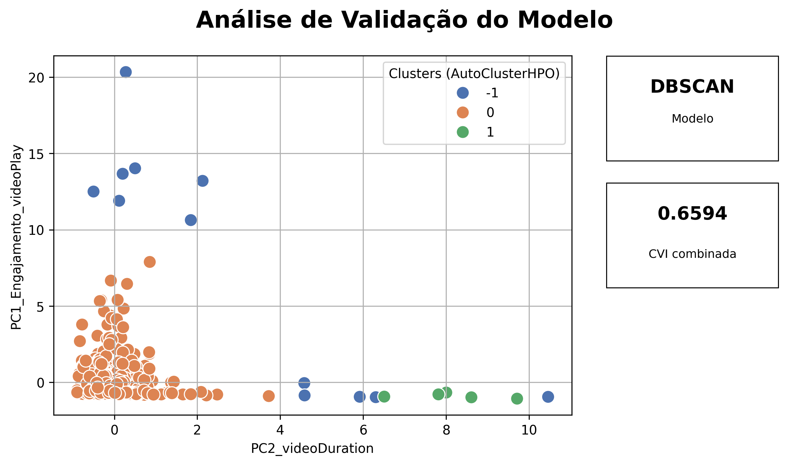

<sup>Os três grupos no espaço PC1 × PC2. O DBSCAN isolou automaticamente os reels de performance anômala no rótulo de ruído (-1).</sup>

### 2.3 Análise de sentimentos

Modelo `cardiffnlp/twitter-xlm-roberta-base-sentiment` via `transformers` — especializado em texto de redes sociais, classifica em `positive` / `neutral` / `negative` e devolve um score de confiança.

O modelo classificou a maioria dos comentários com alta confiança. As classes `positive` e `negative` apresentam scores consistentemente mais altos que `neutral` — comportamento esperado, já que neutralidade é semanticamente mais ambígua.

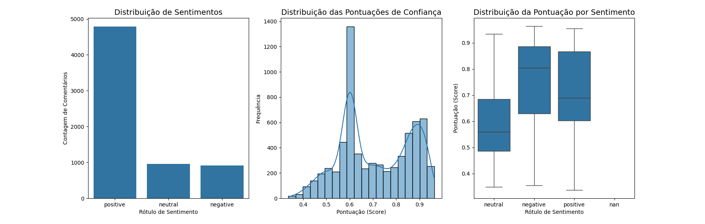

<sup>(a) Distribuição de rótulos · (b) Distribuição dos scores de confiança · (c) Boxplot de scores por sentimento.</sup>

Nos extremos por perfil, a assimetria é brutal: **Clécio Luís** com 92,01% de comentários positivos, contra **Ibaneis** com 51,89% de negativos — mais da metade das interações em seu perfil são críticas. Não existe "governador médio".

<table>
<tr>
<td width="50%">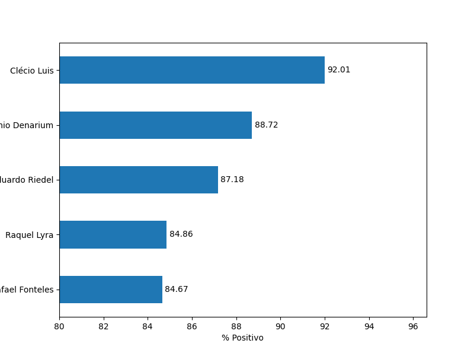</td>
<td width="50%">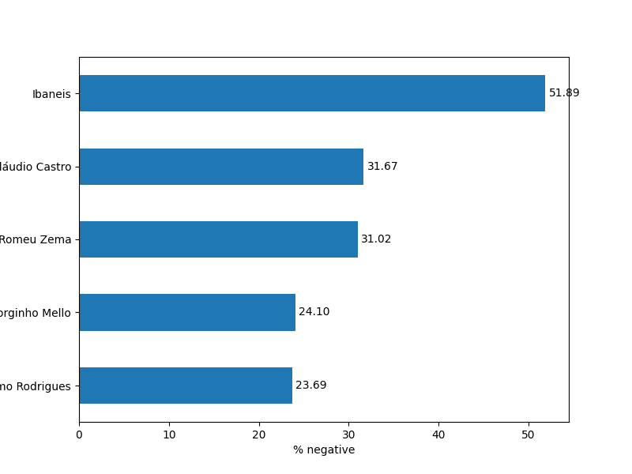</td>
</tr>
<tr>
<td align="center"><sup>Maior percentual de comentários <b>positivos</b></sup></td>
<td align="center"><sup>Maior percentual de comentários <b>negativos</b></sup></td>
</tr>
</table>

### 2.4 Modelagem de tópicos — BERTopic

BERTopic com embeddings de `sentence-transformers` e redução via UMAP identificou **50 temas distintos** no corpus. O mapa de distância intertópica está no topo deste README; abaixo, as duas visões complementares da estrutura desses temas.

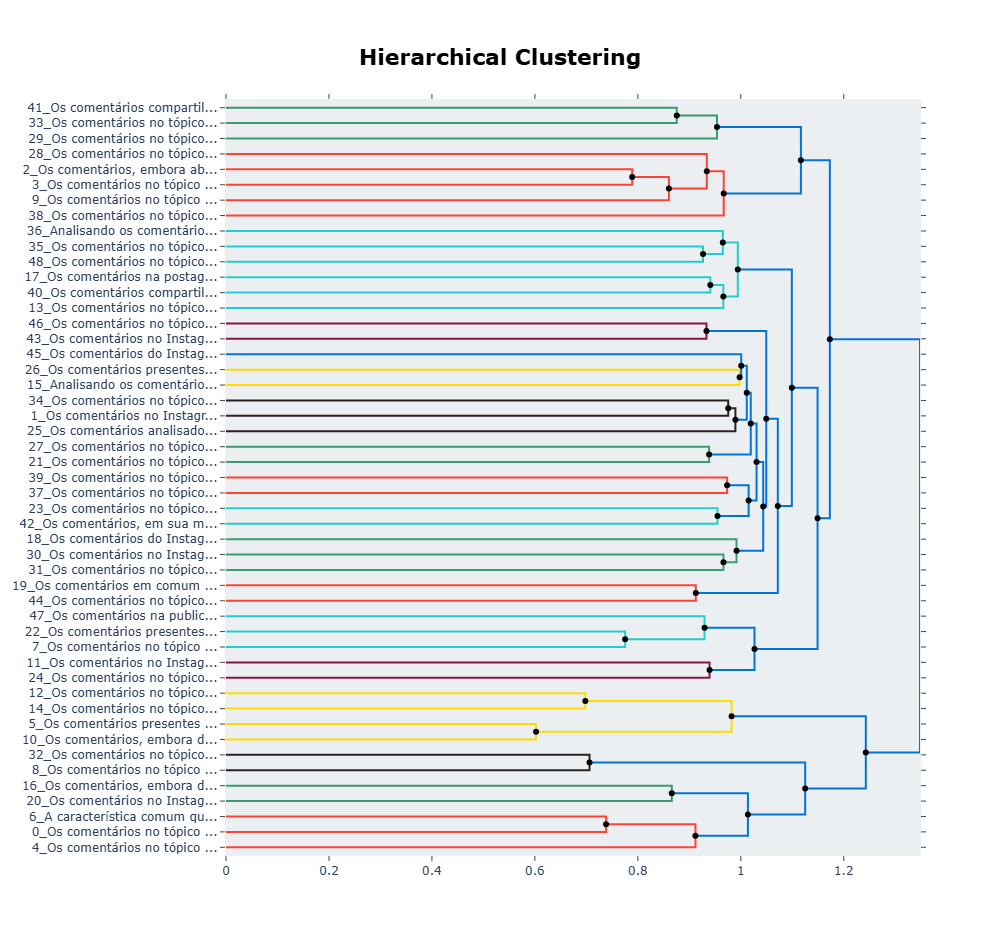

<sup>Dendrograma da clusterização hierárquica dos tópicos — mostra como os 50 temas se agrupam em famílias semânticas.</sup>

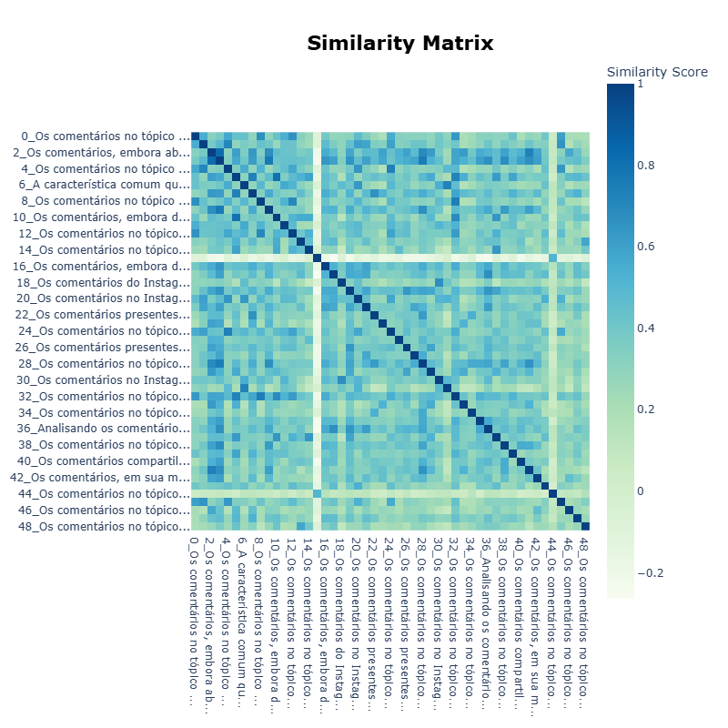

<sup>Matriz de similaridade entre os tópicos. Blocos quentes na diagonal indicam grupos de temas correlacionados.</sup>

### 2.5 O cruzamento — onde a tese se prova

Esta é a etapa que responde ao objetivo específico nº 6. Cruzando a clusterização (métrica) com a análise de sentimentos (qualitativa), cada cluster ganha um significado que nenhuma das análises isoladas produziria:

| Cluster | Positivo | Neutro | Negativo | Leitura |
|---|---|---|---|---|
| **0** — Padrão | 72,3% | 14,1% | 13,7% | Aprovação consistente |
| **-1** — Viral | 53,5% | 25,7% | 20,8% | **Polarizado** — viralidade movida tanto por aclamação quanto por controvérsia |
| **1** — Longo | 60,4% | **27,1%** | 12,5% | **Indiferença** — maior taxa de neutros; falha em provocar reação |

<table>
<tr>
<td width="33%">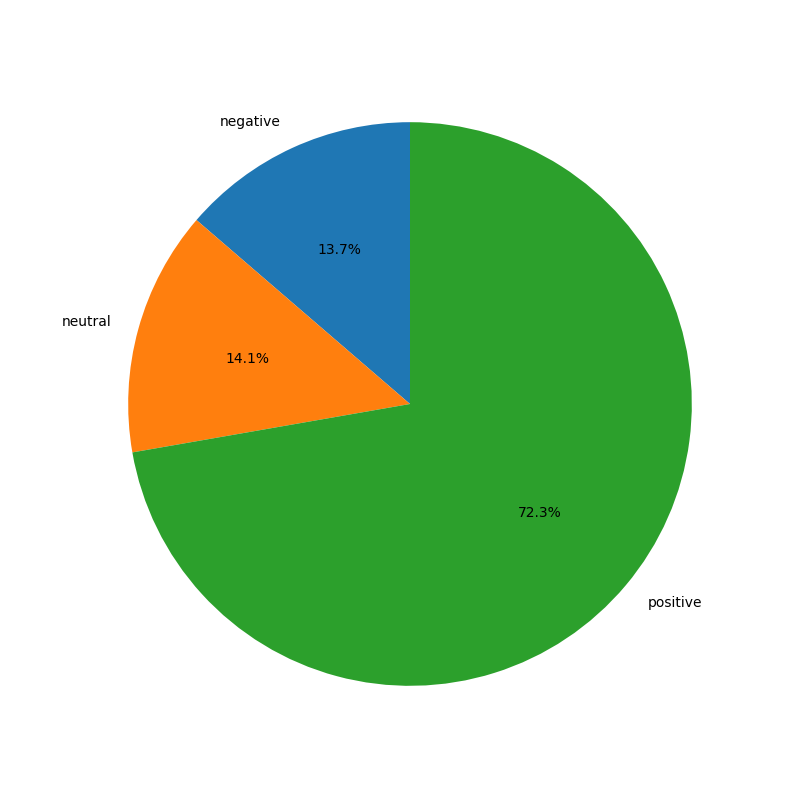</td>
<td width="33%">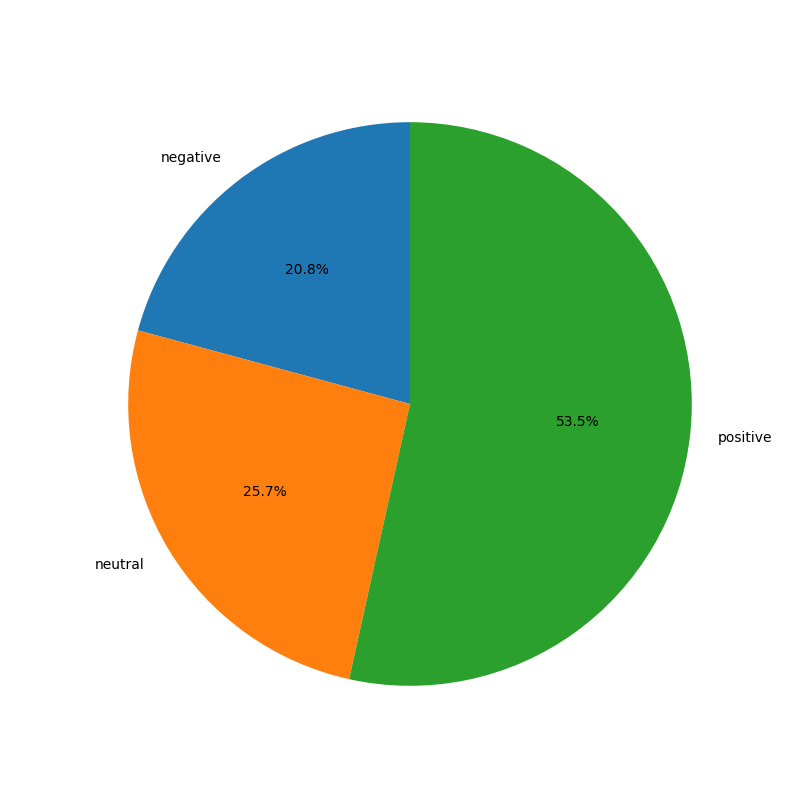</td>
<td width="33%">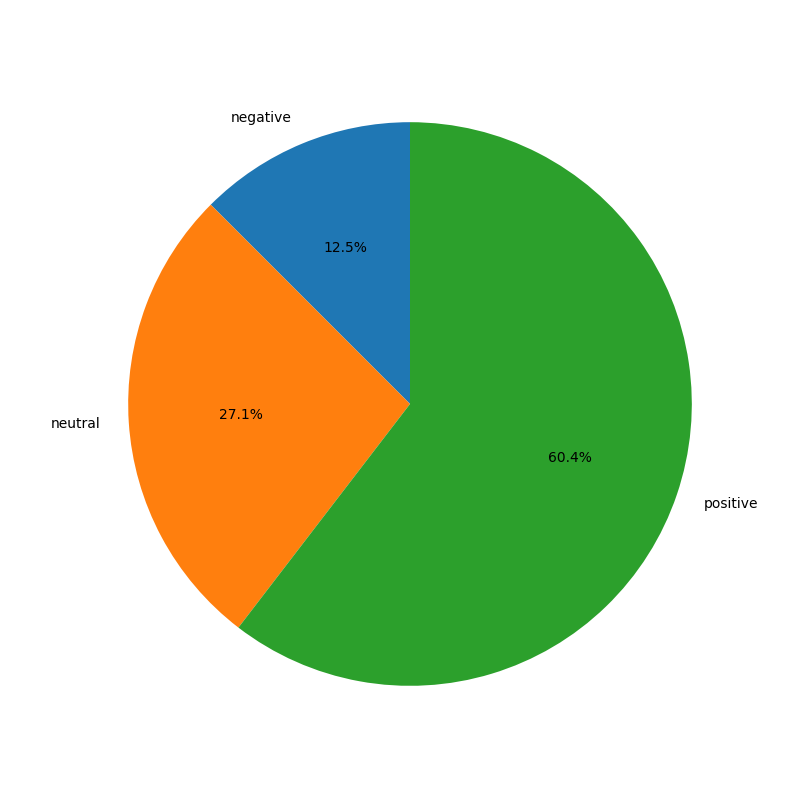</td>
</tr>
<tr>
<td align="center"><sup><b>Cluster 0</b> — Padrão<br/>aprovado</sup></td>
<td align="center"><sup><b>Cluster -1</b> — Viral<br/>debatido</sup></td>
<td align="center"><sup><b>Cluster 1</b> — Longo<br/>ignorado</sup></td>
</tr>
</table>

A conclusão que só a abordagem híbrida permite: **"alto engajamento" não é sinônimo de "alta aprovação"**. O cluster com as métricas mais fortes é também o mais polarizado. O cluster de pior desempenho não gera rejeição — gera indiferença.

---

## 3. Arquitetura de dados

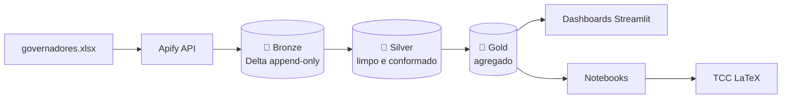

| Camada | Caminho | Tabelas | Escrita por | Garante |
|---|---|---|---|---|
| **Bronze** | `data/bronze/` | `instagram_profiles`, `instagram_posts`, `instagram_reels` | `src/data_extract/bronze_writer.py` | Imutabilidade — append-only, nada é sobrescrito |
| **Silver** | `data/silver/` | `profiles_clean`, `posts_clean`, `reels_clean`, `comments_clean` | `src/features/silver/*_cleaner.py` | Conformidade — tipos, deduplicação, comentários explodidos |
| **Gold** | `data/gold/` | `governor_engagement`, `governor_sentiment`, `governor_clusters` | `src/features/gold/*` | Prontidão — métricas agregadas, resultados de modelagem |

### Leitura dos dados

`src/repositories/delta_repository.py` é a única porta de entrada dos dashboards e notebooks. É **read-only por design** — `save()` levanta `NotImplementedError` deliberadamente; a escrita pertence aos writers de cada camada.

```python
repo = DeltaRepository(gold_dir=settings.GOLD_DIR, silver_dir=settings.SILVER_DIR)
df = repo.load_profiles()

# Reproduzir o estado exato de uma execução anterior
repo_v3 = DeltaRepository(settings.GOLD_DIR, as_of_version=3)
```

### Pipeline local

`pipeline.py` orquestra as três camadas e resolve a fonte dos dados em cascata ([`pipeline.py:62-101`](pipeline.py)):

1. Tabelas Bronze já existentes — o caminho mais barato
2. JSONs em `data/raw/` — migra para Bronze sem chamar a API
3. API Apify — só quando não há nada local (consome créditos)

Passar `force_extract=True` pula direto para a API.

`uv run python pipeline.py --run-modeling` (ou `run_medallion_pipeline(..., run_modeling=True)` chamado diretamente) roda também o estágio determinístico de modelagem (`src.modeling.orchestration.run_deterministic_modeling`) ao final do Gold — desligado por padrão porque é pesado (o embedding do BERTopic sozinho leva ~14 min). O refinamento de tópicos via Gemini nunca é chamado daqui: continua manual, só via `scripts/refine_topics.py` (ver [ADR 0001](docs/adr/0001-separar-modelagem-em-etapas-deterministicas-e-refinamento-manual.md)).

### Scripts de modelagem

O notebook 03 não dispara mais nenhuma escrita — só lê Gold/checkpoint para análise (ver [ADR 0003](docs/adr/0003-desacoplar-modelagem-do-notebook-via-scripts-cli-com-checkpoint.md)). Os disparadores são dois scripts em `scripts/`:

```bash
uv run python scripts/run_modeling.py                  # estágio determinístico, sobre a Silver existente
uv run python scripts/refine_topics.py --run-id <ID>    # refinamento manual via Gemini, sobre o checkpoint acima
```

`run_modeling.py` imprime o `run_id` usado — é esse valor que vai em `--run-id` do `refine_topics.py` (e em `RUN_ID` no notebook 03). Cada chamada de `run_deterministic_modeling` (daqui, do `pipeline.py --run-modeling`, ou do notebook, se alguém ainda chamar diretamente) grava incondicionalmente um checkpoint local em `data/model_checkpoints/<run_id>/` — o `topic_model` do BERTopic, o `df_comments`/`df_reels` provisórios e os modelos de PCA/clustering — porque sem isso o refinamento via Gemini só poderia rodar no mesmo processo que acabou de ajustar o `topic_model`. `refine_topics.py` atualiza esse checkpoint com os rótulos finais depois de refinar.

### Pipeline serverless

As três Lambdas em `lambdas/` reproduzem o mesmo fluxo sobre S3, encadeadas via EventBridge ou Step Functions. **Todas escrevem tabelas Delta** — não há Parquet nem Excel no caminho:

| Lambda | Lê | Escreve |
|---|---|---|
| `extract/handler.py` | API Apify | Bronze Delta em `s3://<bucket>/bronze/` |
| `transform/handler.py` | Bronze Delta | Silver Delta em `s3://<bucket>/silver/` |
| `load/handler.py` | Silver Delta | Gold Delta em `s3://<bucket>/gold/` |

---

## 4. Estrutura do repositório

```
├── app.py                  # Página raiz do Streamlit
├── pipeline.py             # Orquestrador ETL local (Bronze → Silver → Gold)
├── config/settings.py      # Caminhos e parâmetros, sobrescrevíveis por env var
├── src/
│   ├── modeling/            # PCA, AutoClusterHPO, sentimento, tópicos (BERTopic) e refinamento via Gemini
│   ├── data_extract/       # Scraper Apify, leitores JSON, BronzeWriter
│   ├── features/
│   │   ├── silver/         # Cleaners de perfis, posts e comentários
│   │   └── gold/           # Agregador de engajamento, enriquecedor de modelos
│   ├── repositories/       # DeltaRepository (ativo), S3, Excel (legado)
│   ├── schemas_delta.py    # Contratos PyArrow das três camadas
│   ├── run_id.py           # Geração do identificador de execução, compartilhado por pipeline.py e src/modeling/
│   └── visualization/      # Gráficos Plotly reutilizáveis
├── pages/                  # Dashboards Streamlit (exploratório, modelagem)
├── lambdas/                # extract / transform / load para AWS
├── notebooks/              # 01 extração · 02 EDA · 03 modelagem · 04 regressão · 05 síntese
├── tests/                  # 19 arquivos de teste (pytest)
├── data/                   # raw/ · bronze/ · silver/ · gold/ · processed/ (legado)
├── reports/
│   ├── academic/           # TCC completo em LaTeX — 7 capítulos, bibliografia, figuras
│   └── figures/            # Figuras geradas pelos notebooks
└── scripts/                # run_modeling.py, refine_topics.py, migração para Medallion, sync de figuras para o TCC
```

A modelagem roda via `scripts/run_modeling.py` (PCA → `AutoClusterHPO` → sentimento → BERTopic, representação determinística) e `scripts/refine_topics.py` (refinamento manual dos rótulos de tópico via Gemini) — não mais pelo notebook, que virou leitura pura de Gold/checkpoint para análise e visualização (ver [ADR 0003](docs/adr/0003-desacoplar-modelagem-do-notebook-via-scripts-cli-com-checkpoint.md)).

---

## 5. Como executar

### Pré-requisitos

- **Python 3.10+** (o código usa sintaxe `X | None` em anotações avaliadas em tempo de import)
- [uv](https://docs.astral.sh/uv/) — `pip install uv`

### Passo a passo

```bash
# 1. Clonar
git clone https://github.com/Vini0606/Tecnicas-de-Ciencia-de-Dados-em-dados-do-Instagram.git
cd Tecnicas-de-Ciencia-de-Dados-em-dados-do-Instagram

# 2. Ambiente determinístico a partir do uv.lock
uv sync --extra dev

# 3. Variáveis de ambiente
cp .env.example .env      # editar e preencher APIFY_API_TOKEN

# 4. Gerar as tabelas Delta
uv run python pipeline.py

# 5. (opcional) Modelagem — preencher API_GEMINI no .env antes do segundo comando
uv run python scripts/run_modeling.py
uv run python scripts/refine_topics.py --run-id <ID_IMPRESSO_ACIMA>

# 6. Abrir os dashboards
uv run streamlit run app.py     # http://localhost:8501

# 7. Testes e lint
uv run pytest tests/ -v --cov=src --cov-report=term-missing
uv run ruff check src/
```

> **Sobre créditos da API:** os JSONs de `data/raw/` já estão presentes no repositório local, então o passo 4 **não consome créditos Apify** — o pipeline detecta os arquivos e migra para Bronze. Um token só é necessário para coletar dados novos. O passo 5 é opcional e pesado (~14 min só o embedding do BERTopic) — pule se só quiser ver os dashboards com dados de modelagem já existentes.

### Referência rápida de comandos `uv`

| Tarefa | Comando |
|---|---|
| Criar/atualizar ambiente | `uv sync --extra dev` |
| Adicionar dependência | `uv add <pacote>` (`--dev` para desenvolvimento) |
| Executar script | `uv run python <script>.py` |
| Executar testes | `uv run pytest` |
| Executar dashboards | `uv run streamlit run app.py` |
| Abrir notebooks | `uv run jupyter lab notebooks/` |
| Atualizar lockfile | `uv lock --upgrade` |

### Variáveis de ambiente

| Variável | Obrigatória | Padrão | Descrição |
|---|---|---|---|
| `APIFY_API_TOKEN` | Só para coleta nova | — | Token da API Apify |
| `DATA_DIR` | Não | `data` | Raiz dos dados |
| `RESULTS_LIMIT` | Não | `30` | Posts/reels por perfil |
| `RANDOM_STATE` | Não | `42` | Semente de reprodutibilidade |
| `S3_BUCKET` | Só em cloud | `""` | Bucket para as Lambdas |
| `S3_BRONZE_PREFIX` / `S3_SILVER_PREFIX` / `S3_GOLD_PREFIX` | Não | `bronze/` `silver/` `gold/` | Prefixos S3 por camada |

Lista completa em `config/settings.py`.

---

## 6. Estado atual e limitações conhecidas

O pipeline roda de ponta a ponta: `uv run python pipeline.py` materializa Bronze, Silver e Gold, e ambos os dashboards carregam. As tabelas Delta não são versionadas (`data/` está no `.gitignore`), então um clone novo precisa executar o pipeline uma vez — os JSONs de `data/raw/` bastam, sem consumir créditos da API.

Esta seção registra honestamente o que ainda não está fechado.

**O ciclo da modelagem fecha via dois scripts, não mais pelo notebook.** `scripts/run_modeling.py` lê a Silver via `DeltaRepository` e roda o estágio determinístico (PCA → `AutoClusterHPO` → sentimento → BERTopic com representação determinística via `KeyBERTInspired`, sem depender de API externa), gravando clusters e sentimento/tópicos provisórios em Gold via `ModelEnricher` sob um `run_id`, e um checkpoint local em `data/model_checkpoints/<run_id>/` (o `topic_model` do BERTopic, `df_comments`/`df_reels`, os modelos de PCA/clustering). `scripts/refine_topics.py --run-id <ID>` carrega esse checkpoint e roda o refinamento manual dos rótulos de tópico via Gemini (`GeminiDocsRefiner`) — depende de uma API key do Gemini e é uma etapa de revisão humana (o texto gerado vira citação no TCC), por isso continua separada e manual mesmo com o estágio determinístico automatizável (ver [ADR 0001](docs/adr/0001-separar-modelagem-em-etapas-deterministicas-e-refinamento-manual.md) e [ADR 0003](docs/adr/0003-desacoplar-modelagem-do-notebook-via-scripts-cli-com-checkpoint.md)); reescreve `governor_sentiment` sob um segundo `run_id` e atualiza o checkpoint com os rótulos finais. Sentimento e tópicos vivem em `governor_sentiment` (os tópicos do BERTopic viajam junto, nas colunas `Topic`/`Name` — não há uma tabela separada), e clusters em `governor_clusters`. A clusterização é por **reel** (PCA de engajamento/duração do vídeo via `AutoClusterHPO`), não por perfil — não há, e nunca houve, clusterização de governadores no projeto. `notebooks/03_modelagem_hibrida.ipynb` agora só lê (`governor_sentiment`/`governor_clusters` da Gold, mais o checkpoint para as visualizações de PCA/validação de cluster) — não dispara nenhuma escrita. O dashboard de modelagem (`pages/02_modeling.py`) exibe a distribuição de sentimento, os tópicos mais frequentes e os clusters de reels assim que essas tabelas existem — e se ainda não existirem, mostra instruções em vez de quebrar.

**Notebooks já migrados para Delta.** Os 5 notebooks usam `DeltaRepository`/`run_medallion_pipeline` — nenhum lê mais `all.xlsx` como fonte de pipeline (o notebook 01 só toca Excel para ler `governadores.xlsx`, a lista de perfis a coletar, que é configuração, não dado).

**Pendências de documentação.** Os capítulos 6 (Resultados) e 7 (Conclusões) do TCC ainda estão no texto-modelo, embora os resultados já existam e estejam redigidos no capítulo 5.

### Próximos passos

1. Completar os capítulos 6 (Resultados) e 7 (Conclusões) do TCC

---

## 7. Testes e CI

| Arquivo | O que verifica |
|---|---|
| `test_bronze_writer.py` | Escrita e leitura da Bronze, comportamento append-only, erro em dados vazios, histórico Delta |
| `test_silver_cleaners.py` | `ProfileCleaner`, `PostCleaner` e `CommentCleaner` — tipagem, fallback de `fullName`, explosão de comentários |
| `test_delta_repository.py` | `DeltaRepository` lê uma tabela Gold escrita em diretório temporário |
| `test_repository.py` | Leitura das tabelas Delta reais (pula quando não materializadas) |
| `test_delta_io.py` | Conformação ao contrato de schema: descarta colunas extras, cria as anuláveis ausentes e falha em campo obrigatório vazio |
| `test_engagement_aggregator.py` | Perfil sem publicações não recebe recência máxima, agregados conformam ao contrato Gold, `% ENGAJAMENTO` não divide por zero |
| `test_model_enricher.py` | `write_sentiment`/`write_clusters` na granularidade de reel, falha clara quando falta coluna esperada |
| `test_engagement.py` | `EngagementFeatureBuilder` cria `TOTAL ENGAJAMENTO`, `% ENGAJAMENTO`, `RECENCIA`, `FREQUENCIA` e não gera percentuais negativos |
| `test_comments.py` | `CommentsTransformer` filtra comentários com 512 caracteres ou mais |
| `test_transform_lambda.py` | Handler Silver retorna `200` / `silver_complete`; retorna `400` sem `S3_BUCKET` |
| `test_load_lambda.py` | Handler Gold retorna `200` / `gold_complete`; retorna `400` sem `S3_BUCKET` |

**Resultado atual: 34 testes, todos passando.**

`.github/workflows/python-app.yml` roda a cada push e pull request na `main`: checkout, Python 3.11, `pip install -e .[dev]`, pytest com cobertura e `ruff check src/`.

---

## 8. Dependências e referências

O núcleo do projeto: **`deltalake`** e **`pyarrow`** para as tabelas Delta e contratos de schema; **`pandas`** em todo o pipeline; **`transformers`** e **`torch`** para a análise de sentimentos; **`bertopic`** e **`sentence-transformers`** para a modelagem de tópicos; **`scikit-learn`** e **`hyperopt`** para PCA e o `AutoClusterHPO`; **`streamlit`** e **`plotly`** para os dashboards; **`apify-client`** para a coleta.

Lista completa e versões em `pyproject.toml` e `uv.lock`.

### Documentação do trabalho

| Recurso | Onde |
|---|---|
| TCC completo (LaTeX, 7 capítulos) | `reports/academic/` |
| Metodologia e resultados detalhados | `reports/academic/Capítulos/Capitulo_05_Modelagem.tex` |
| Dicionário de dados | `reports/academic/Dicionário de Dados.xlsx` |
| Bibliografia | `reports/academic/IESB-CDeIA-Bibliografia.bib` |
| Figuras geradas | `reports/figures/` |

### Legado

`data/processed/all.xlsx` e o diretório `legacy/` são resquícios da implementação original baseada em Excel, anterior à migração para Delta Lake. São mantidos apenas para os notebooks 01 e 02, que ainda não foram convertidos. **Nenhum fluxo ativo depende deles.**
