# Técnicas de NLP em Dados do Instagram

[](https://github.com/Vini0606/Tecnicas-de-Ciencia-de-Dados-em-dados-do-Instagram/actions/workflows/python-app.yml)


**Autor:** Vinícius de Paula R. Carvalho
**Trabalho de Conclusão de Curso** — Ciência de Dados e Inteligência Artificial, IESB

Este repositório é a implementação completa de um TCC que **propõe e valida uma metodologia híbrida de Processamento de Linguagem Natural**: em vez de aplicar análise de sentimentos, modelagem de tópicos e clusterização isoladamente, o trabalho as integra e demonstra que a combinação revela o que nenhuma delas mostra sozinha. O estudo de caso são os perfis de Instagram dos **27 governadores do Brasil**.

O achado central, em uma frase: **o conteúdo padrão é aprovado, o viral é debatido, e o longo é ignorado.** Nenhuma das três técnicas, isolada, chega a essa conclusão.

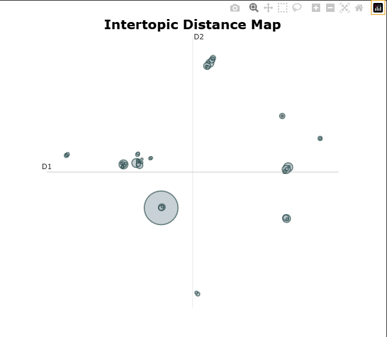

<sup>Mapa de distância intertópica dos 50 temas identificados por BERTopic no corpus de comentários. Círculos próximos são semanticamente similares; o tamanho é proporcional à frequência do tópico.</sup>

---

## Sumário

1. [Contexto da pesquisa](#1-contexto-da-pesquisa)
2. [Metodologia híbrida e resultados](#2-metodologia-híbrida-e-resultados)
3. [Arquitetura de dados](#3-arquitetura-de-dados)
4. [Estrutura do repositório](#4-estrutura-do-repositório)
5. [Como executar](#5-como-executar)
6. [Estado atual e limitações conhecidas](#6-estado-atual-e-limitações-conhecidas)
7. [Testes e CI](#7-testes-e-ci)
8. [Dependências e referências](#8-dependências-e-referências)

---

## 1. Contexto da pesquisa

### O problema

As mídias sociais se consolidaram como plataformas centrais na formação da opinião pública, mas o volume e a natureza não estruturada dos comentários tornam a análise manual impraticável. A lacuna que este trabalho ataca não é a falta de ferramentas — é o fato de que as abordagens tradicionais aplicam essas ferramentas **isoladamente**. Medir apenas a polaridade do sentimento não diz *sobre o quê* o público reage; extrair apenas tópicos não diz *como* o público reage; agrupar apenas por métricas não diz *nada* sobre conteúdo.

### A hipótese

A integração sinérgica de análise de sentimentos, modelagem de tópicos e clusterização produz uma leitura da percepção pública mais granular do que a soma das partes.

### Objetivo geral

> Desenvolver e validar uma metodologia de modelagem híbrida baseada em Processamento de Linguagem Natural que combine análise de sentimentos, modelagem de tópicos e técnicas de clusterização para análise de publicações e comentários de redes sociais.

### Objetivos específicos

1. Estruturar um pipeline de processamento de dados textuais (limpeza, normalização, preparação)
2. Aplicar análise de sentimentos para identificar polaridades
3. Implementar modelagem de tópicos para extrair os temas discutidos
4. Aplicar clusterização para agrupar publicações por semelhança
5. Validar em estudo de caso real — os governadores do Brasil
6. **Comparar com abordagens isoladas**, evidenciando as vantagens da integração

O objetivo nº 6 é o que diferencia o trabalho: não basta aplicar as três técnicas, é preciso provar que juntas valem mais.

### O corpus

| Dimensão | Volume |
|---|---|
| Perfis de governadores | 27 (todos verificados e públicos) |
| Posts do feed | 810 |
| Reels | 810 |
| Comentários coletados | ~13.500 (6.777 em reels + 6.749 em posts) |

Coleta via [Apify](https://apify.com), a partir da lista curada em `reference/governadores.xlsx`. Os números acima são os da Coleta usada no TCC; a amostra de teste mais recente tem poucos posts por governador (a coleta completa vem depois).

### Por que engenharia de dados em um TCC de NLP

Esta é uma decisão de projeto deliberada, não excesso de escopo. Um resultado acadêmico precisa ser **reproduzível**: qualquer número citado no texto do TCC deve poder ser recuperado meses depois, exatamente como estava. Um pipeline que sobrescreve arquivos Excel não oferece isso.

A arquitetura Medallion sobre Delta Lake resolve o problema com três garantias:

- **Coletas versionadas** — cada Coleta fica salva e marcada por uma tag no dataset privado do Hugging Face ([ADR 0039](docs/adr/0039-coleta-versionada-no-hf-bronze-fiel-e-aws-so-reconstroi.md)); a mais recente é sempre a vigente e qualquer número do TCC pode ser refeito a partir da tag
- **Time travel** — `DeltaRepository(as_of_version=…)` recupera uma versão anterior de uma tabela Delta local
- **Linhagem** — a Bronze guarda o item completo da Apify na coluna `_raw` e os metadados `_run_id`, `_ingested_at` e `_source`; o `manifesto.json` de cada Coleta registra Recorte pedido, cobertura real, custo e contagem de linhas
- **Contratos de schema** — `src/schemas_delta.py` declara os tipos de cada camada, com `nullable=False` nas camadas Silver e Gold como validação *fail-fast*

---

## 2. Metodologia híbrida e resultados

As quatro técnicas são aplicadas em sequência, cada uma alimentando a seguinte. Os resultados abaixo estão documentados em `reports/academic/Capítulos/Capitulo_05_Modelagem.tex`.

### 2.1 PCA — redução dimensional

As métricas numéricas dos reels foram reduzidas a dois componentes que retêm **92% da variância**:

| Componente | Variância | Interpretação | Carga dominante |
|---|---|---|---|
| PC1 | 67% | Índice de Engajamento | `likesCount` 0.59 · `videoPlayCount` 0.57 · `commentsCount` 0.56 |
| PC2 | 25% | Fator de Duração | `videoDuration` 1.00 |

A separação é limpa: PC1 mede repercussão, PC2 mede duração, e um não contamina o outro. Isso torna a clusterização subsequente interpretável.

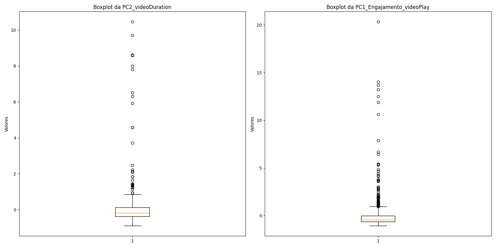

<sup>Distribuição de PC1 (Engajamento) e PC2 (Duração). A longa cauda de outliers positivos em ambos é o que justifica escolher, na etapa seguinte, um algoritmo robusto a outliers.</sup>

### 2.2 Clusterização automática — `AutoClusterHPO`

`src/modeling/clustering.py` é a peça original do trabalho. Em vez de arbitrar o número de clusters, ele conduz uma busca automatizada:

- Testa **KMeans, DBSCAN e Agglomerative Clustering**, cada um com seu próprio espaço de hiperparâmetros
- Otimiza via **TPE (Hyperopt)**, 50 avaliações por algoritmo
- Avalia com um **score CVI combinado** — Silhouette + Calinski-Harabasz normalizado por `tanh(chi/10000)` + Davies-Bouldin invertido por `tanh(1/dbi)` ([`clustering.py:77-88`](src/modeling/clustering.py))
- Filtra os pontos de ruído do DBSCAN antes de calcular os índices, evitando a distorção que invalidaria a comparação entre algoritmos

**Resultado:** o framework elegeu **DBSCAN** (`eps=1.40`, `min_samples=5`) com score CVI combinado de **0.6594**, encontrando três grupos:

| Cluster | Reels | Perfil | Duração média |
|---|---|---|---|
| **0** — Padrão | 792 | Engajamento moderado e consistente | 64,5 s |
| **-1** — Viral | 12 | ~4.843 comentários, ~90k curtidas, 1,12M views | 26–900 s |
| **1** — Longo / Baixa performance | 6 | Pior desempenho em todas as métricas | 721 s (~12 min) |

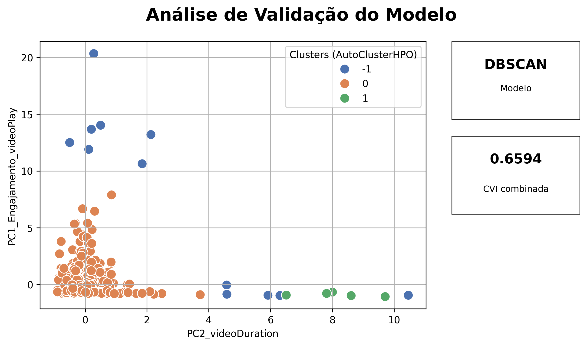

<sup>Os três grupos no espaço PC1 × PC2. O DBSCAN isolou automaticamente os reels de performance anômala no rótulo de ruído (-1).</sup>

### 2.3 Análise de sentimentos

Modelo `cardiffnlp/twitter-xlm-roberta-base-sentiment` via `transformers` — especializado em texto de redes sociais, classifica em `positive` / `neutral` / `negative` e devolve um score de confiança.

O modelo classificou a maioria dos comentários com alta confiança. As classes `positive` e `negative` apresentam scores consistentemente mais altos que `neutral` — comportamento esperado, já que neutralidade é semanticamente mais ambígua.

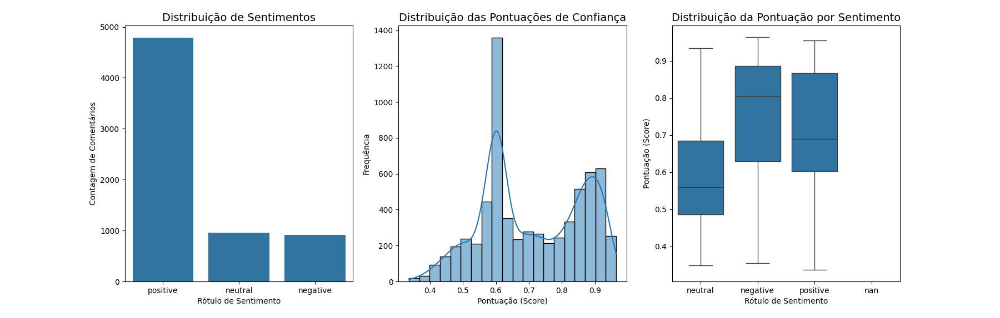

<sup>(a) Distribuição de rótulos · (b) Distribuição dos scores de confiança · (c) Boxplot de scores por sentimento.</sup>

Nos extremos por perfil, a assimetria é brutal: **Clécio Luís** com 92,01% de comentários positivos, contra **Ibaneis** com 51,89% de negativos — mais da metade das interações em seu perfil são críticas. Não existe "governador médio".

<table>
<tr>
<td width="50%">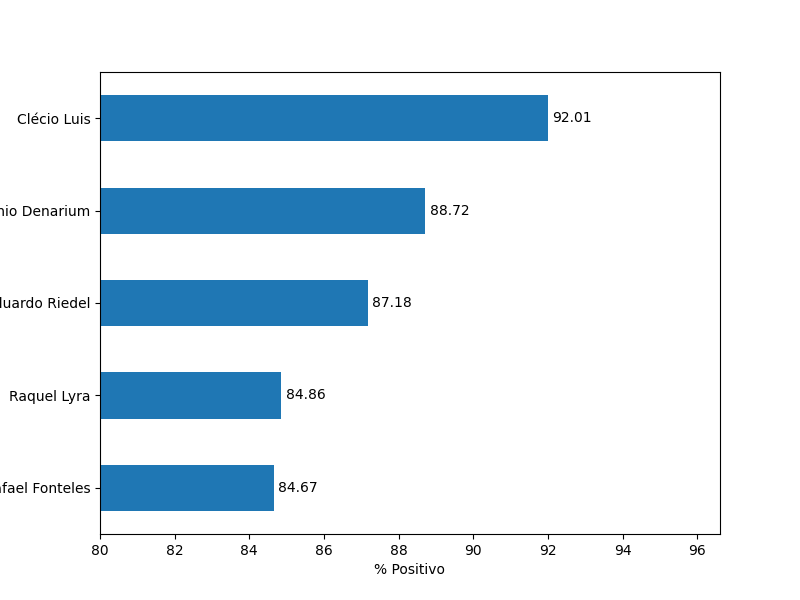</td>
<td width="50%">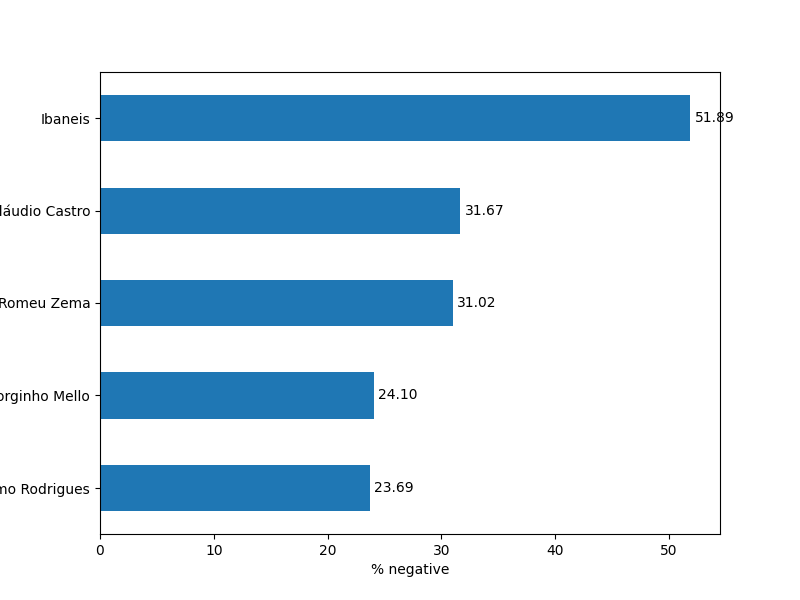</td>
</tr>
<tr>
<td align="center"><sup>Maior percentual de comentários <b>positivos</b></sup></td>
<td align="center"><sup>Maior percentual de comentários <b>negativos</b></sup></td>
</tr>
</table>

### 2.4 Modelagem de tópicos — BERTopic

BERTopic com embeddings de `sentence-transformers` e redução via UMAP identificou **50 temas distintos** no corpus. O mapa de distância intertópica está no topo deste README; abaixo, as duas visões complementares da estrutura desses temas.

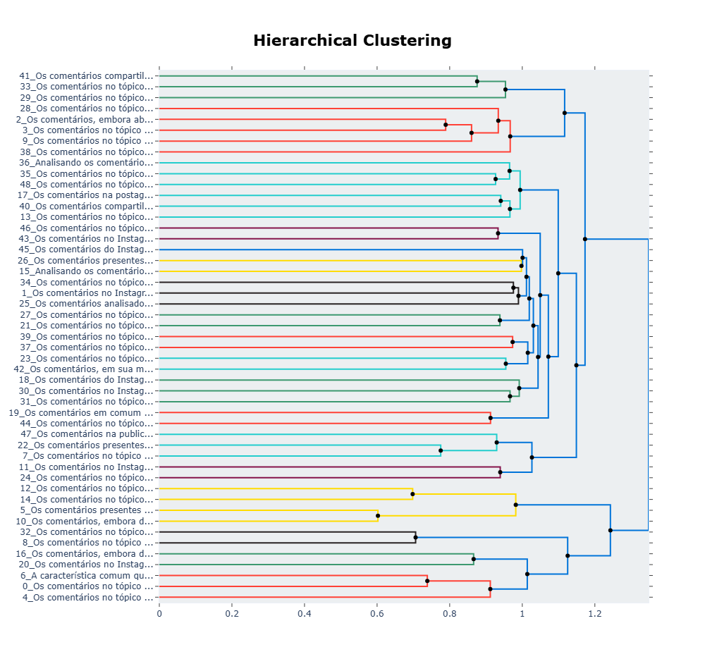

<sup>Dendrograma da clusterização hierárquica dos tópicos — mostra como os 50 temas se agrupam em famílias semânticas.</sup>

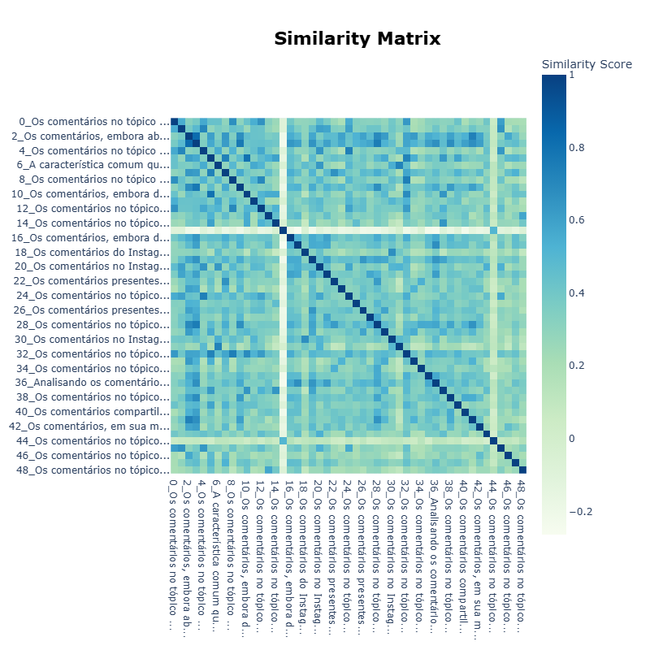

<sup>Matriz de similaridade entre os tópicos. Blocos quentes na diagonal indicam grupos de temas correlacionados.</sup>

### 2.5 O cruzamento — onde a tese se prova

Esta é a etapa que responde ao objetivo específico nº 6. Cruzando a clusterização (métrica) com a análise de sentimentos (qualitativa), cada cluster ganha um significado que nenhuma das análises isoladas produziria:

| Cluster | Positivo | Neutro | Negativo | Leitura |
|---|---|---|---|---|
| **0** — Padrão | 72,3% | 14,1% | 13,7% | Aprovação consistente |
| **-1** — Viral | 53,5% | 25,7% | 20,8% | **Polarizado** — viralidade movida tanto por aclamação quanto por controvérsia |
| **1** — Longo | 60,4% | **27,1%** | 12,5% | **Indiferença** — maior taxa de neutros; falha em provocar reação |

<table>
<tr>
<td width="33%">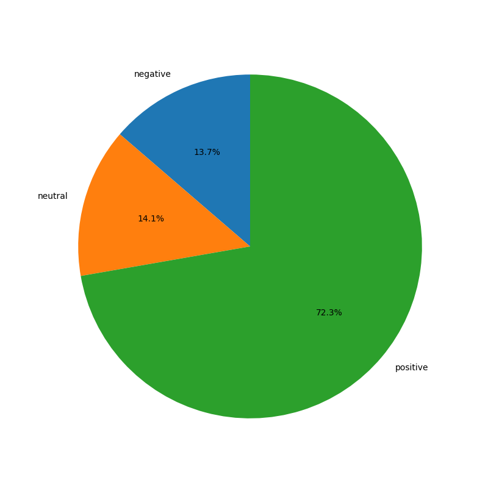</td>
<td width="33%">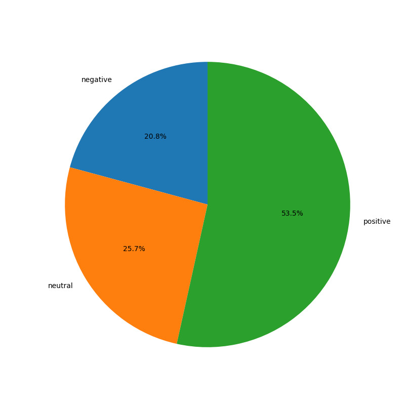</td>
<td width="33%">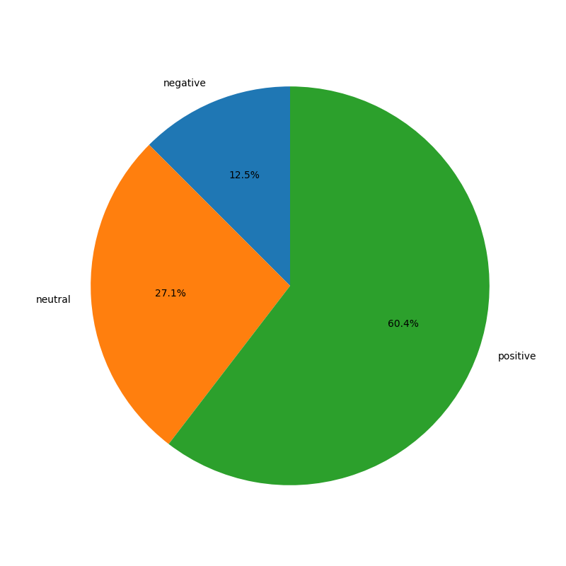</td>
</tr>
<tr>
<td align="center"><sup><b>Cluster 0</b> — Padrão<br/>aprovado</sup></td>
<td align="center"><sup><b>Cluster -1</b> — Viral<br/>debatido</sup></td>
<td align="center"><sup><b>Cluster 1</b> — Longo<br/>ignorado</sup></td>
</tr>
</table>

A conclusão que só a abordagem híbrida permite: **"alto engajamento" não é sinônimo de "alta aprovação"**. O cluster com as métricas mais fortes é também o mais polarizado. O cluster de pior desempenho não gera rejeição — gera indiferença.

---

## 3. Arquitetura de dados

O fluxo é **Coleta → Snapshot → Hugging Face → dashboard / AWS** ([ADR 0039](docs/adr/0039-coleta-versionada-no-hf-bronze-fiel-e-aws-so-reconstroi.md)).
Os termos (**Coleta**, **Recorte**, **Snapshot**) estão definidos em `CONTEXT.md`.

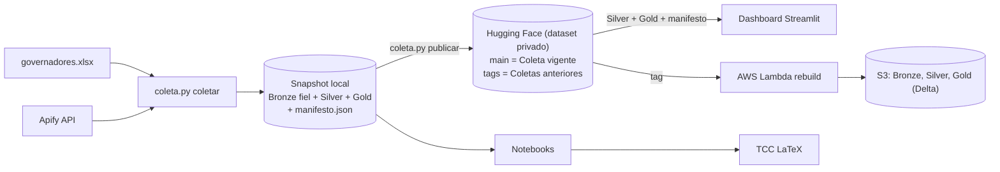
```mermaid
flowchart LR
    G[governadores.xlsx] --> C["coleta.py coletar"]
    A[Apify API] --> C
    C --> S[("Snapshot local<br/>Bronze fiel + Silver + Gold<br/>+ manifesto.json")]
    S -->|"coleta.py publicar"| H[("Hugging Face (dataset privado)<br/>main = Coleta vigente<br/>tags = Coletas anteriores")]
    H -->|"Silver + Gold + manifesto"| D[Dashboard Streamlit]
    H -->|"tag"| R["AWS Lambda rebuild"]
    R --> B[("S3: Bronze, Silver, Gold (Delta)")]
    S --> N[Notebooks]
    N --> T[TCC LaTeX]
```

| Camada | Caminho | Tabelas | Escrita por | Garante |
|---|---|---|---|---|
| **Bronze** | `data/bronze/` | `instagram_profiles`, `instagram_posts` (com `latestComments`), `instagram_reels`, `ugc_mentions` | `src/data_extract/bronze_writer.py`, via `extract_and_land` | Fidelidade: colunas tipadas + `_ingested_at`, `_run_id`, `_source` e `_raw` (o item completo da Apify, nada descartado). **Overwrite por Coleta**; não há landing zone |
| **Silver** | `data/silver/` | `profiles_clean`, `posts_clean`, `reels_clean`, `comments_clean` (reels), `post_comments_clean` (posts), `governors_metadata`, `ugc_mentions` | `src/features/silver/*_cleaner.py` | Conformidade: tipos, deduplicação dentro da Coleta, comentários explodidos. Parsing e validação ficam aqui |
| **Gold** | `data/gold/` | `governor_engagement(_history)`, `governor_sentiment(_history)`, `governor_discourse_topics`, `governor_clusters_reels`, `governor_clusters_posts`, `governor_profile_clusters_engagement`, `post_performance_coefficients`/`predictions`, `topic_priority_score`, `content_topic_priority_score`, `governor_nsm`, `governor_scorecard`, `governor_growth_metrics`, `governor_ugc_mentions` — lista completa e colunas em `reference/dicionario_de_dados_medallion.xlsx` | `src/features/gold/*`, `src/modeling/*` | Prontidão: métricas agregadas, resultados de modelagem |

A derivação Silver/Gold a partir da Bronze é uma etapa única (`src/coleta/derivacao.py`), usada pela Coleta local e pela Lambda de reconstrução.

**Sem histórico entre Coletas.** A Bronze é regravada a cada Coleta e uma Coleta substitui a outra como vigente; as anteriores
ficam acessíveis pelas tags. Por isso saíram a `governor_nsm_history` e o "vs. execução anterior" do dashboard, e a comparação
temporal passa a vir de dentro de uma Coleta (datas das publicações). Continuam existindo `governor_engagement_history` e
`governor_sentiment_history`, tabelas paralelas às originais com o mesmo schema, que alimentam as métricas de crescimento de
`governor_growth_metrics`: a de engajamento é escrita em `append` por `coleta.py coletar` (mas a pasta de destino começa vazia) e
em `overwrite` na reconstrução da Lambda. O refinamento de tópicos via Gemini (`scripts/refine_topics.py`) reescreve as linhas de
comentário de `governor_sentiment` (preservando legenda/transcrição) mas **não** grava no histórico. Clusters não têm tabela de
histórico.

**Comentários de reels e de posts** ([ADR 0034](docs/adr/0034-pipeline-ponto-unico-ugc-no-extrator-comentarios-de-posts-janela-e-relatorio.md)).
Os comentários de posts de feed ficam numa Silver própria (`post_comments_clean`, com `id_post`),
separada de `comments_clean` (reels, `id_reel`). A modelagem une as duas origens
(`src/modeling/comment_sources.py`), deduplicando por `id_comment` e preferindo a linha de reel
(um reel também aparece no scraper de posts). Em `governor_sentiment`/`_history`, a coluna
`origem_comentario` (`reel`/`post`) diz de onde veio cada comentário, e `id_reel` passa a
significar "id da publicação comentada". Legenda e transcrição têm `origem_comentario` nulo.

### Leitura dos dados

`src/repositories/delta_repository.py` é a única porta de entrada dos dashboards e notebooks. É **read-only por design** — `save()` levanta `NotImplementedError` deliberadamente; a escrita pertence aos writers de cada camada.

```python
repo = DeltaRepository(gold_dir=settings.GOLD_DIR, silver_dir=settings.SILVER_DIR)
df = repo.load_profiles()

# Reproduzir uma versão anterior de uma tabela Gold
repo_v3 = DeltaRepository(settings.GOLD_DIR, as_of_version=3)
```

### Coleta, Snapshot e Hugging Face

`coleta.py` (módulo `src/coleta/`) é o caminho único para extrair, publicar, restaurar, listar e baixar Coletas:

| Comando | O que faz |
|---|---|
| `coletar` | Extrai um **Recorte** da Apify (`--dias N`, ou `--inicio`/`--fim`, e `--teto N` itens por perfil) para uma pasta de dados **limpa** (`--destino`), grava a Bronze fiel, deriva Silver e Gold e escreve o `manifesto.json`. Sem `--yes`, só mostra a estimativa de custo (pior caso). `--modelar` roda também a modelagem determinística (exige `DATA_DIR=<destino>`) |
| `publicar <pasta>` | Publica o Snapshot no Hugging Face como a Coleta vigente: **um único commit** de substituição na `main` + a tag da Coleta. Sem `--yes`, só mostra o plano. `--rotulo` troca o rótulo da tag |
| `restaurar <tag>` | Traz uma Coleta antiga de volta para a `main` (novo commit, tag nova com rótulo `restaurada`) |
| `listar` | Lista as Coletas (tags) do dataset |
| `baixar <tag> --destino <pasta>` | Baixa o Snapshot de uma tag |

A tag segue a gramática `coleta_<extração>[_<janela>][_<teto>][_<rótulo>]` (ex.: `coleta_2026-10-09_ultimos-90d_teto-250`), em
`docs/agents/coletas.md`. A `main` guarda só a Coleta vigente; as anteriores ficam em tags e nunca são apagadas nem reescritas
(sem force-push). O manifesto traz identidade, Recorte pedido, cobertura real por fonte e perfil, custo e tabelas derivadas com
linhas — sem conteúdo (nomes, textos) nem segredos.

### Modelagem

O notebook 03 não dispara mais nenhuma escrita — só lê Gold/checkpoint para análise (ver [ADR 0003](docs/adr/0003-desacoplar-modelagem-do-notebook-via-scripts-cli-com-checkpoint.md)). Os disparadores são `coleta.py coletar --modelar` e dois scripts em `scripts/`:

```bash
uv run python scripts/run_modeling.py --parent-run-id <RUN_ID_DA_COLETA>   # estágio determinístico, sobre a Silver existente
uv run python scripts/refine_topics.py --run-id <ID>                       # refinamento manual via Gemini, sobre o checkpoint acima
```

`--parent-run-id` é obrigatório — é o `run_id` da Coleta que gerou a Silver sendo usada aqui, gravado no checkpoint só para rastreabilidade (dados → modelo, ver `scripts/inspect_runs.py --pipeline`); nunca substitui o `run_id` próprio que a modelagem sempre cunha (ADR 0001).

`run_modeling.py` imprime o `run_id` usado — é esse valor que vai em `--run-id` do `refine_topics.py` (e em `RUN_ID` no notebook 03). Cada chamada de `run_deterministic_modeling` grava incondicionalmente um checkpoint local em `data/model_checkpoints/<run_id>/` — o `topic_model` do BERTopic, o `df_comments`/`df_reels` provisórios e os modelos de PCA/clustering — porque sem isso o refinamento via Gemini só poderia rodar no mesmo processo que acabou de ajustar o `topic_model`. `refine_topics.py` atualiza esse checkpoint com os rótulos finais depois de refinar. A modelagem determinística inclui a clusterização de PERFIL de governador por engajamento (`governor_profile_clusters_engagement`, ADR 0020). O refinamento via Gemini nunca é chamado da CLI da Coleta: continua manual (ver [ADR 0001](docs/adr/0001-separar-modelagem-em-etapas-deterministicas-e-refinamento-manual.md)).

### Reconstrução na nuvem (AWS Lambda)

A nuvem **não extrai nem agenda** (ADR 0039, decisão 8): a única Lambda, `lambdas/rebuild/`, baixa
uma **tag de Coleta** do dataset privado no Hugging Face e reconstrói Bronze, Silver e Gold como
tabelas **Delta Lake** em `s3://<bucket>/{bronze,silver,gold}/`: copia a Bronze do Snapshot, deriva de novo Silver e Gold de
engajamento/UGC (`src/coleta/derivacao.py`, só etapas determinísticas) e copia as demais tabelas Gold (modelagem) como estão.
Extração (Apify) e modelagem pesada (BERTopic) continuam locais.

| Lambda | Lê | Escreve | Memória | Timeout | Variáveis |
|---|---|---|---|---|---|
| `rebuild/handler.py` | Snapshot da tag no Hugging Face | Bronze, Silver e Gold Delta no S3 | 3008 MB (+5 GB em `/tmp`) | 900s (teto AWS) | `S3_BUCKET`, `HF_TOKEN`, `HF_DATASET_REPO` |

Evento: `{"tag": "coleta_...", "run_id": "opcional"}`. Invocação sempre manual (`aws lambda invoke`); `S3_BASE_PREFIX` (opcional) define um prefixo dentro do bucket.
Roda como **imagem de container** (`pyarrow`/`deltalake` têm binários nativos), publicada no ECR.

### Infraestrutura provisionada (Terraform)

`infra/main.tf` (Terraform ≥ 1.6) declara:

- **1 bucket S3** — o data lake, mesmo layout de prefixos que `data/` localmente
- **1 repositório ECR** (`rebuild`) com lifecycle que mantém só as **10 imagens mais recentes**
- **IAM mínimo** para a `rebuild`: execução básica + `s3:ListBucket`/`GetObject`/`PutObject`/`DeleteObject`
  só no bucket do data lake; `HF_TOKEN`/`HF_DATASET_REPO` entram como variáveis sensíveis
- **IAM/OIDC do GitHub Actions** — role federada que a CI assume sem credenciais estáticas, com a
  trust policy restrita a `repo:<este repositório>:ref:refs/heads/main`

O `terraform apply` é sempre manual e nunca foi aplicado. Passo a passo em
[`infra/README.md`](infra/README.md).

### CI/CD: publicação da imagem via GitHub Actions (OIDC)

`.github/workflows/build-lambdas.yml` builda e publica a imagem `rebuild` no ECR a cada push em
`main` que passe no CI e mexa em `lambdas/**` ou `src/**`, tagueada com o SHA do commit, sem AWS
access key armazenada (ver [ADR 0009](docs/adr/0009-publicar-imagens-das-lambdas-via-github-actions-com-oidc.md)).
Publicar a imagem **não** atualiza a Lambda em execução — promover é manual:

```bash
TF_VAR_image_tag=$(git rev-parse origin/main) terraform apply
```

> No PowerShell (Windows): `$env:TF_VAR_image_tag = git rev-parse origin/main; terraform apply`

### Limitações conhecidas

- **Teto de 15 minutos** — a reconstrução precisa caber no timeout máximo de Lambda (900s).
- **Sem retry/DLQ** — uma falha na invocação manual não deixa rastro além da resposta e dos logs do CloudWatch.
- **Custo não é zero indefinidamente** — `terraform apply` é sempre uma decisão manual do autor.

---

## 4. Estrutura do repositório

```
├── coleta.py               # CLI da Coleta: coletar, publicar, restaurar, listar, baixar (ADR 0039)
├── dashboard/               # Dashboard Streamlit "por decisão" (ADR 0021) -- entrypoint real do produto
│   ├── app.py               # `streamlit run dashboard/app.py` -- navegação por st.radio entre as telas de TELAS
│   ├── core/                # data.py (loaders @st.cache_data), theme.py (paleta semafórica + chrome IESB), components.py (faixa de decisão, KPIs, rodapé), deltas.py (limiar de alerta de negatividade), acesso.py (senha, ADR 0037), bootstrap_dados.py (baixa Silver+Gold do HF), coleta_em_uso.py (qual Coleta o app mostra)
│   └── screens/             # Uma tela por decisão do analista -- resumo.py (Tela 1, contêiner das sub-abas resumo_nsm/resumo_funil/resumo_scorecard, ADR 0031) é a primeira, ver ADR 0021
├── config/settings.py      # Caminhos e parâmetros, sobrescrevíveis por env var
├── src/
│   ├── coleta/             # Módulo Coleta (ADR 0039): recorte (Recorte e tag), custo, coletar, manifesto, derivacao (Silver/Gold a partir da Bronze), hf (publicar/baixar/listar/restaurar no Hugging Face), reconstruir (usado pela Lambda), cli
│   ├── modeling/           # PCA, AutoClusterHPO, sentimento, tópicos (BERTopic), clusterização de perfil (Fase 2) e refinamento via Gemini
│   ├── data_extract/       # Scraper Apify (scraper.py), BronzeWriter (Bronze fiel, coluna `_raw`), extract_and_land
│   ├── analysis/           # Diagnósticos usados pelos notebooks de diagnóstico Medallion (ADR 0022)
│   ├── features/
│   │   ├── silver/         # Cleaners de perfis, posts, reels, comentários e UGC
│   │   └── gold/           # Agregador de engajamento, enriquecedor de modelos, NSM, UGC
│   ├── repositories/       # DeltaRepository -- única porta de leitura, local ou S3 via storage_options
│   ├── schemas_delta.py    # Contratos PyArrow das três camadas
│   ├── delta_io.py         # Escrita/leitura Delta com validação de schema e deduplicate_latest
│   ├── dados_hf.py / publicacao_hf.py  # Download de Silver e Gold do HF para o dashboard (ADR 0036; `HF_DATASET_REVISAO`)
│   ├── pipeline_report.py  # Relatório final de tabelas (usado por `coleta.py coletar --modelar`)
│   ├── logging_setup.py    # Setup de logging por run_id -- console INFO / arquivo DEBUG (ADR 0015)
│   ├── run_id.py           # Geração do identificador de execução, compartilhado por src/coleta e src/modeling
│   └── visualization/      # Gráficos Plotly reutilizáveis
├── lambdas/rebuild/        # Única Lambda: baixa uma tag de Coleta do HF e reconstrói Bronze/Silver/Gold no S3 (ver seção 3)
├── infra/                  # Terraform: bucket S3, ECR do rebuild, Lambda rebuild e role OIDC do GitHub Actions
├── notebooks/              # 01 extração e limpeza · 02 EDA · 03 modelagem híbrida · 05 visualização e conclusões · 06/07 regressão de performance (vídeo / estático) · diagnostico_medallion/ (ADR 0022)
├── tests/                  # 63 arquivos de teste (pytest)
├── data/                   # Efêmero, fora do git (.gitignore) -- ver seção 3 pra Bronze/Silver/Gold
│   ├── bronze/                     # Delta fiel (overwrite por Coleta): instagram_profiles, instagram_posts, instagram_reels, ugc_mentions
│   ├── silver/                     # Delta limpo/conformado: profiles_clean, posts_clean, reels_clean, comments_clean, post_comments_clean, governors_metadata, ugc_mentions
│   ├── gold/                       # Delta agregado: governor_engagement(_history), governor_sentiment(_history), governor_discourse_topics, governor_clusters_reels, governor_clusters_posts, governor_profile_clusters_engagement, post_performance_coefficients/predictions, topic_priority_score, content_topic_priority_score, governor_nsm, governor_scorecard, governor_growth_metrics, governor_ugc_mentions
│   ├── manifesto.json              # Manifesto da Coleta (só na pasta de um Snapshot)
│   ├── model_checkpoints/<run_id>/ # Checkpoint do estágio determinístico de modelagem -- topic_model, PCA, clustering (ADR 0003)
│   └── logs/<run_id>/              # Log estruturado por run_id -- console INFO / arquivo DEBUG (ADR 0015)
├── reference/              # governadores.xlsx (dado de entrada mantido manualmente, ADR 0013) + dicionario_de_dados_medallion.xlsx (catálogo de dados, gerado por scripts/generate_data_dictionary.py)
├── reports/
│   ├── academic/           # TCC completo em LaTeX — 7 capítulos, bibliografia, figuras
│   └── figures/            # Figuras geradas pelos notebooks
├── docs/
│   ├── adr/                # ADRs -- registro das decisões de arquitetura (0001-0039)
│   ├── agents/             # Convenções para agentes de IA (issue tracker, labels de triagem, docs de domínio, coletas) -- ver CLAUDE.md
│   ├── dashboard/          # Especificação da reformulação do dashboard de growth (ADR 0020) -- histórica, o dashboard atual segue a ADR 0021
│   └── research/           # Notas de pesquisa (ex.: mapeamento de actors Apify para o framework COBRA)
└── scripts/                # run_modeling.py, refine_topics.py, run_growth_metrics.py, run_governor_scorecard.py, run_profile_clustering_engagement.py, inspect_runs.py, generate_data_dictionary.py, apify_backfill_shared.py (funções de custo/links usadas por src/coleta), build_and_push_lambdas.sh (fallback manual da imagem rebuild), sync de figuras para o TCC
```

A modelagem roda via `coleta.py coletar --modelar`, `scripts/run_modeling.py` (PCA → `AutoClusterHPO` → sentimento → BERTopic, representação determinística) e `scripts/refine_topics.py` (refinamento manual dos rótulos de tópico via Gemini) — não mais pelo notebook, que virou leitura pura de Gold/checkpoint para análise e visualização (ver [ADR 0003](docs/adr/0003-desacoplar-modelagem-do-notebook-via-scripts-cli-com-checkpoint.md)).

---

## 5. Como executar

### Pré-requisitos

- **Python 3.10+** (o código usa sintaxe `X | None` em anotações avaliadas em tempo de import)
- [uv](https://docs.astral.sh/uv/) — `pip install uv`

### Fluxo principal — do zero, com `coleta.py`

`data/` começa vazia no clone (só os `.gitkeep`; Bronze/Silver/Gold não são versionados). Há dois caminhos: **baixar** uma Coleta já publicada (sem custo) ou **extrair** uma nova (custo real na Apify).

```bash
# 1. Clonar
git clone https://github.com/Vini0606/Tecnicas-de-Ciencia-de-Dados-em-dados-do-Instagram.git
cd Tecnicas-de-Ciencia-de-Dados-em-dados-do-Instagram

# 2. Ambiente determinístico a partir do uv.lock
uv sync --extra dev

# 3. Variáveis de ambiente
cp .env.example .env      # editar: APIFY_API_TOKEN (extrair) e HF_TOKEN + HF_DATASET_REPO (publicar/baixar)
```

**Caminho A. Levar uma Coleta já publicada para esta máquina (sem custo):**

```bash
uv run python coleta.py listar                                      # tags disponíveis
uv run python coleta.py baixar coleta_2026-10-09_ultimos-90d_teto-250 --destino data
uv run streamlit run dashboard/app.py                               # http://localhost:8501
```

**Caminho B. Extrair uma Coleta nova (Apify, custo real):**

```bash
# 4. Sem --yes, só mostra o Recorte e a estimativa de custo (pior caso); nada é gasto.
#    O destino deve ser uma pasta de dados LIMPA, nunca a data/ em uso.
uv run python coleta.py coletar --dias 90 --teto 250 --destino C:\dados\coleta_nova

# 5. Extração de verdade (gasta créditos da Apify), grava Bronze fiel, Silver, Gold e manifesto.json
uv run python coleta.py coletar --dias 90 --teto 250 --destino C:\dados\coleta_nova --yes

# 6. (opcional, pesado) incluir a modelagem determinística; exige DATA_DIR apontando para o destino
#    PowerShell: $env:DATA_DIR = "C:\dados\coleta_nova"
uv run python coleta.py coletar --dias 90 --teto 250 --destino C:\dados\coleta_nova --yes --modelar

# 7. Publicar como a Coleta vigente: sem --yes mostra o plano; com --yes envia um único commit e cria a tag
uv run python coleta.py publicar C:\dados\coleta_nova
uv run python coleta.py publicar C:\dados\coleta_nova --yes

# 8. (opcional) Rótulos legíveis de pauta e de grupo de comentários (manual, ADR 0001; exige API_GEMINI)
uv run python scripts/refine_topics.py --run-id <RUN_ID_DA_MODELAGEM>

# 9. Testes e lint
uv run pytest tests/ -v --cov=src --cov-report=term-missing
uv run ruff check src/
```

**Flags do `coleta.py coletar`:**

| Flag | Efeito |
|---|---|
| `--dias N` | Janela relativa: só publicações dos últimos N dias (`onlyPostsNewerThan`). |
| `--inicio AAAA-MM-DD` / `--fim AAAA-MM-DD` | Intervalo absoluto do Recorte. |
| `--teto N` | Teto de itens por perfil em cada coleção (posts, reels e UGC). Sem ele, o padrão do projeto é `RESULTS_LIMIT` (30) ou, com janela, um padrão proporcional à janela. |
| `--rotulo texto` | Rótulo opcional no fim da tag (minúsculas, dígitos e `-`). Duas Coletas com o mesmo nome (mesmo dia e Recorte) exigem um rótulo. |
| `--destino pasta` | Obrigatória. Pasta de dados limpa; o comando recusa uma pasta não vazia. |
| `--yes` | Confirma o gasto real na Apify. Sem ele, o comando só imprime o custo estimado e termina. |
| `--modelar` | Roda também a modelagem determinística (~15–30 min; na primeira vez, baixa ~2,5 GB de modelos do Hugging Face) e imprime o relatório de tabelas. |

> **Sobre créditos da API:** são três coleções pagas (posts, reels e UGC). A estimativa mostrada antes do `--yes` é de pior caso; com 26 perfis e teto 30, ~US$ 5,38. Re-extrair uma janela maior repaga o período sobreposto, porque uma Coleta substitui a outra, não a complementa.

**Relatório de tabelas e código de saída (`--modelar`).** Ao final, a CLI lista cada tabela esperada com status, linhas e último commit:

```
[RELATORIO] Tabelas esperadas:
tabela                | estagio   | dashboard | status         | linhas | ultimo commit (UTC)
...
governor_scorecard    | modelagem | sim       | OK             | 26     | 2026-10-06 15:42:10
governor_ugc_mentions | ugc       | sim       | AUSENTE        | -      | -
[RELATORIO] Resumo: OK=20, AUSENTE=1.
```

| Status | Significado |
|---|---|
| `OK` | Reescrita nesta execução, com linhas. |
| `AUSENTE` | A tabela não existe. |
| `VAZIA` | Reescrita nesta execução, sem linhas. |
| `DESATUALIZADA` | O último commit é anterior ao início da execução (estágio pulado; versão velha no disco). |
| `NAO SOLICITADA` | O estágio não rodou. Não é falha. |

O processo sai com **1** se alguma tabela **lida pelo dashboard** de um estágio executado não estiver OK. Tabelas que só a modelagem usa (por exemplo `post_performance_*`, que a ADR 0019 pula com pouco dado) aparecem como aviso. Os estágios pulados ficam no log de cada `run_id`, em `data/logs/`.

### Fluxos alternativos

Scripts standalone em `scripts/`, para cenários que o fluxo principal não cobre. Cada um roda isolado, sem reprocessar os estágios anteriores.

#### Só re-rodar a modelagem (Bronze/Silver/Gold-engagement já existem)

Útil para repetir a modelagem sobre uma Coleta específica (`--parent-run-id`) sem reprocessar Silver/Gold-engagement:

```bash
uv run python scripts/run_modeling.py --parent-run-id <RUN_ID_DA_COLETA>
```

#### Refinar rótulos de tópico via Gemini (etapa manual, revisão humana)

Nunca roda sozinho dentro da CLI da Coleta (decisão da ADR 0001) — só depois de inspecionar os tópicos provisórios em `governor_sentiment`/`governor_discourse_topics`:

```bash
# preencher API_GEMINI no .env antes
uv run python scripts/refine_topics.py --run-id <RUN_ID_DO_CHECKPOINT_DE_MODELAGEM>
# opcional: --target comments | discourse (padrao: all = comentarios + discurso)
```

Por padrao o script refina os topicos de comentario (`governor_sentiment`, preservando as linhas de legenda/transcricao, e o Score ICE) **e** os topicos de discurso (`governor_discourse_topics`, assunto das legendas). O ruido (`-1`) nao e refinado e o topico degenerado (sem palavra alguma) recebe o rotulo "sem assunto definido". Checkpoints gravados antes da issue #186 nao tem o modelo de discurso: com `--target discourse` o script falha com mensagem clara; com o padrao, pula o discurso.

**Procedimento e ordem relativa ao ICE de pautas.** (1) Rode `run_modeling.py` (ou `coleta.py coletar --modelar`) e anote o `run_id`: ele grava o checkpoint (incluindo o modelo de discurso) e um `content_topic_priority_score` *provisorio*, com rotulos brutos. (2) Confira os topicos provisorios em `governor_sentiment`/`governor_discourse_topics` (etapa de revisao humana). (3) Rode o refino com `--target all` (comentarios primeiro, depois discurso) ou `--target discourse`; o ICE de pautas (`content_topic_priority_score`) e **recalculado dentro do refino de discurso**, a partir dos comentarios do checkpoint (ja refinados no `all`), entao nao ha comando separado e **nao** se roda o ICE antes do refino. (4) `--target comments` sozinho nao toca `governor_discourse_topics` nem o ICE de pautas. O refino real com Gemini ainda **nao foi rodado** sobre os dados de producao: ate la os rotulos de pauta na fila de "O que produzir" sao os provisorios do BERTopic (palavras-chave; topico sem palavra alguma aparece como "sem assunto definido"). O refino de discurso nunca mexe nas linhas de legenda/transcricao de `governor_sentiment`.

#### Métricas pós-modelagem independentes (ADR 0020)

Rodam sobre tabelas Gold já existentes, sem depender uma da outra nem do restante da modelagem:

```bash
uv run python scripts/run_growth_metrics.py                  # CMGR + retenção de sentimento -> governor_growth_metrics (Ficha 7)
uv run python scripts/run_governor_scorecard.py               # Escore composto dos governadores -> governor_scorecard (ADR 0030; tambem roda em --modelar)
```

`governor_nsm`, `topic_priority_score`, `governor_discourse_topics` e `governor_profile_clusters_engagement` já saem de `coleta.py coletar --modelar` / `scripts/run_modeling.py` — não precisam de script separado. `scripts/run_profile_clustering_engagement.py` continua existindo só para re-rodar esse estágio isolado (ex.: depois de um ajuste que só afeta a clusterização de perfil), sem repetir toda a modelagem determinística.

`governor_growth_metrics` (CMGR de audiência e retenção de sentimento positivo) segue gerada, mas hoje sem consumidor no dashboard: os KPIs de crescimento que a sub-aba NSM do Resumo exibia foram removidos (`dashboard/core/data.py::load_growth_metrics()` permanece disponível). `governor_scorecard` e `content_topic_priority_score` são lidas pela sub-aba Scorecard e pela fila de pautas de "O que produzir", respectivamente.

#### UGC de menções (ADR 0020, Ficha 8 / issue #93)

O UGC (posts de terceiros que marcam ou mencionam o governador, `apify/instagram-tagged-scraper`) é coletado em toda Coleta, como última etapa tolerante a falha da extração ([ADR 0034](docs/adr/0034-pipeline-ponto-unico-ugc-no-extrator-comentarios-de-posts-janela-e-relatorio.md)). O script de piloto isolado e o de coleta standalone foram removidos. A amostra atual de UGC é de teste (poucos posts por governador); a coleta completa vem depois.

#### Publicar o dashboard no Streamlit Cloud (dados do Hugging Face)

O dashboard lê `data/silver` e `data/gold`, que não vão para o git. Em um deploy, esses diretórios (e o `manifesto.json`) são baixados do
**dataset privado do Hugging Face** onde as Coletas são publicadas ([ADR 0036](docs/adr/0036-dashboard-no-streamlit-cloud-com-silver-e-gold-baixados-do-hugging-face.md), [ADR 0039](docs/adr/0039-coleta-versionada-no-hf-bronze-fiel-e-aws-so-reconstroi.md)).

1. **Publicar** (de quem rodou a Coleta), com `HF_TOKEN` (escrita) e `HF_DATASET_REPO` no `.env`: `coleta.py publicar <pasta>` (mostra o plano) e depois `... --yes` (envia).
2. **No Streamlit Cloud:** entrypoint `dashboard/app.py`; em *Settings > Secrets* adicione
   `HF_TOKEN = "<token>"`, `HF_DATASET_REPO = "<usuario>/<nome>"` e
   `APP_PASSWORD = "<senha longa>"` (o app pede essa senha; sem ela, fora do `localhost`, ele fica
   **bloqueado**, [ADR 0037](docs/adr/0037-dashboard-exige-senha-no-proprio-app.md)). Em *Share*, restrinja os visualizadores (há
   comentários de terceiros nos dados). Depois, *Reboot*.
3. **Trocar de Coleta:** publique a nova (vira a `main`) e reinicie o app. Para mostrar uma Coleta antiga sem mexer na `main`,
   defina `HF_DATASET_REVISAO = "<tag ou commit>"` nos Secrets.

Opcional e mais seguro: um dataset só do dashboard (`HF_DATASET_REPO_PUBLICACAO`) com um token só de leitura nos
Secrets, para o app nunca alcançar a Bronze.

O deploy instala só `dashboard/requirements.txt` (sem bertopic nem PyTorch).

#### Levar os dados coletados para outra máquina (dataset privado no Hugging Face)

A coleta é paga, e o repositório é público, com dado pessoal de terceiros na Bronze. Por isso, os dados **não** vão para o git: ficam no
**dataset privado no Hugging Face**, versionados por Coleta ([ADR 0039](docs/adr/0039-coleta-versionada-no-hf-bronze-fiel-e-aws-so-reconstroi.md), que superou parte da [ADR 0035](docs/adr/0035-dados-coletados-distribuidos-por-dataset-privado-no-hugging-face.md)).

1. **Uma vez por máquina:** crie no Hugging Face um token **fine-grained** com acesso só ao dataset (escrita na máquina que publica, leitura basta nas demais) e preencha `HF_TOKEN` e `HF_DATASET_REPO` no `.env`.
2. **Na máquina que coletou:** `uv run python coleta.py publicar <pasta>` mostra o plano; com `--yes`, envia o Snapshot num único commit e cria a tag.
3. **Na outra máquina:** `listar` e `baixar`, e depois, se quiser, `coleta.py restaurar <tag>` para trazer uma Coleta antiga de volta à `main`:

```bash
uv run python coleta.py listar
uv run python coleta.py baixar <tag> --destino data
uv run python coleta.py restaurar <tag> --yes        # opcional: a tag volta a ser a Coleta vigente (novo commit, tag nova)
```

`publicar` e `restaurar` recusam tag já existente e passar do limite de armazenamento (`--limite-bytes`); nunca apagam o commit de uma Coleta anterior. Silver e Gold fazem parte do Snapshot (Bronze + Silver + Gold + manifesto); checkpoints de modelagem e logs não sobem.

#### Reconstruir na nuvem a partir de uma tag (AWS)

Depois de aplicar o Terraform e publicar a imagem (seção 3), a reconstrução é manual:

```bash
aws lambda invoke --function-name <nome-da-lambda-rebuild> --payload '{"tag": "<tag>"}' --cli-binary-format raw-in-base64-out saida.json
```

#### Inspecionar `run_id`s espalhados pelo projeto

Consolida `data/logs/`, `data/model_checkpoints/` e as colunas `_run_id` da Bronze/Silver/Gold numa visão única (o script ainda procura as pastas legadas `data/landing/` e `data/backfill/`, que a Coleta não cria mais):

```bash
uv run python scripts/inspect_runs.py                    # lista todos os run_id conhecidos
uv run python scripts/inspect_runs.py --run-id <ID>       # detalhe de um run_id específico
uv run python scripts/inspect_runs.py --pipeline <ID>     # Coleta <ID> + toda modelagem que ela disparou
```

### Referência rápida de comandos `uv`

| Tarefa | Comando |
|---|---|
| Criar/atualizar ambiente | `uv sync --extra dev` |
| Adicionar dependência | `uv add <pacote>` (`--dev` para desenvolvimento) |
| Executar script | `uv run python <script>.py` |
| Executar testes | `uv run pytest` |
| Executar dashboards | `uv run streamlit run dashboard/app.py` |
| Abrir notebooks | `uv run jupyter lab notebooks/` |
| Atualizar lockfile | `uv lock --upgrade` |

### Variáveis de ambiente

| Variável | Obrigatória | Padrão | Descrição |
|---|---|---|---|
| `APIFY_API_TOKEN` | Só para coleta nova | — | Token da API Apify |
| `DATA_DIR` | Não | `data` | Raiz dos dados |
| `RESULTS_LIMIT` | Não | `30` | Teto padrão de itens por perfil quando a Coleta não recebe `--teto` |
| `RANDOM_STATE` | Não | `42` | Semente de reprodutibilidade |
| `API_GEMINI` | Só para `scripts/refine_topics.py` | — | Chave do Gemini para o refinamento manual de tópicos (ADR 0001) |
| `S3_BUCKET` | Só em cloud | `""` | Bucket da Lambda rebuild |
| `S3_BASE_PREFIX` | Não | `""` | Prefixo dentro do bucket onde a Lambda rebuild grava `bronze/`, `silver/` e `gold/` |
| `S3_BRONZE_PREFIX` / `S3_SILVER_PREFIX` / `S3_GOLD_PREFIX` | Não | `bronze/` `silver/` `gold/` | Prefixos S3 por camada (`.env.example`) |
| `HF_TOKEN` | Para publicar, baixar, listar e no dashboard publicado | — | Token fine-grained do Hugging Face, com acesso só ao dataset |
| `HF_DATASET_REPO` | Idem | — | Dataset privado `<usuario>/<nome>` com as Coletas (Snapshot: Bronze, Silver, Gold e manifesto; ADR 0039) |
| `HF_DATASET_REPO_PUBLICACAO` | Não | `HF_DATASET_REPO` | Dataset separado só para o dashboard (ADR 0036) |
| `HF_DATASET_REVISAO` | Não | `main` | Tag ou commit que o dashboard mostra, em vez da Coleta vigente (ADR 0039) |
| `APP_PASSWORD` | Obrigatória fora do `localhost` | — | Senha do dashboard publicado (ADR 0037) |
| `JANELA_ALERTA_NEGATIVIDADE_DIAS` | Não | `7` | Janela (dias) da comparação do Radar de crise (ADR 0025) |

`S3_BUCKET`, `S3_BASE_PREFIX`, `HF_TOKEN` e `HF_DATASET_REPO` são lidas diretamente pelo handler em `lambdas/rebuild/`, não por
`config/settings.py` (ver ADR 0007). Lista completa das demais em `config/settings.py`.

---

## 6. Estado atual e limitações conhecidas

O fluxo roda de ponta a ponta: `coleta.py coletar --yes --modelar` materializa Bronze fiel, Silver, Gold e a modelagem, valida as tabelas no relatório final, `coleta.py publicar` envia o Snapshot ao Hugging Face e o `dashboard/app.py` o carrega. As tabelas Delta não são versionadas (`data/` está no `.gitignore`), então um clone novo tem dois caminhos: baixar uma Coleta do dataset privado no Hugging Face com `coleta.py baixar`, sem custo ([ADR 0039](docs/adr/0039-coleta-versionada-no-hf-bronze-fiel-e-aws-so-reconstroi.md)), ou fazer uma extração real na Apify (custo real, exige `--yes`). A infraestrutura AWS (`infra/`) **nunca foi aplicada**; a nuvem só reconstrói uma Coleta a partir de uma tag.

Esta seção registra honestamente o que ainda não está fechado.

**O ciclo da modelagem fecha via dois scripts, não mais pelo notebook.** `scripts/run_modeling.py` lê a Silver via `DeltaRepository` e roda o estágio determinístico (PCA → `AutoClusterHPO` → sentimento → BERTopic com representação determinística via `KeyBERTInspired`, sem depender de API externa), gravando clusters e sentimento/tópicos provisórios em Gold via `ModelEnricher` sob um `run_id`, e um checkpoint local em `data/model_checkpoints/<run_id>/` (o `topic_model` do BERTopic, `df_comments`/`df_reels`, os modelos de PCA/clustering). `scripts/refine_topics.py --run-id <ID>` carrega esse checkpoint e roda o refinamento manual dos rótulos de tópico via Gemini (`GeminiDocsRefiner`) — depende de uma API key do Gemini e é uma etapa de revisão humana (o texto gerado vira citação no TCC), por isso continua separada e manual mesmo com o estágio determinístico automatizável (ver [ADR 0001](docs/adr/0001-separar-modelagem-em-etapas-deterministicas-e-refinamento-manual.md) e [ADR 0003](docs/adr/0003-desacoplar-modelagem-do-notebook-via-scripts-cli-com-checkpoint.md)); reescreve `governor_sentiment` sob um segundo `run_id` e atualiza o checkpoint com os rótulos finais. Sentimento e tópicos vivem em `governor_sentiment` (os tópicos do BERTopic viajam junto, nas colunas `Topic`/`Name` — não há uma tabela separada), e clusters em `governor_clusters_reels`/`governor_clusters_posts` — duas tabelas por formato (issue #152) em vez de uma `governor_clusters` combinada, porque `posts_clean`/`reels_clean` se sobrepõem (um Reel também é capturado pelo post-scraper genérico no grid do perfil) e uma tabela única duplicava o mesmo post real sob os dois `content_type`. Cada uma é por **reel** ou **post** (PCA de engajamento/duração do vídeo via `AutoClusterHPO`), não por perfil — a clusterização *de perfil*, por engajamento, é outra tabela, `governor_profile_clusters_engagement` (Fase 2, ADR 0020), gerada dentro do mesmo `run_deterministic_modeling` desde que essa etapa foi integrada ao estágio determinístico (antes só saía de `scripts/run_profile_clustering_engagement.py`, rodado à parte). `notebooks/03_modelagem_hibrida.ipynb` agora só lê (`governor_sentiment`/`governor_clusters_reels`/`governor_clusters_posts` da Gold, mais o checkpoint para as visualizações de PCA/validação de cluster) — não dispara nenhuma escrita.

**Notebooks já migrados para Delta.** Os 6 notebooks leem as tabelas Delta via `DeltaRepository` — nenhum lê mais `all.xlsx` como fonte de pipeline (o notebook 01 só toca Excel para ler `governadores.xlsx`, a lista de perfis a coletar, que é configuração, não dado).

**Notebooks de diagnóstico Medallion (ADR 0022), separados da narrativa do TCC.** `notebooks/diagnostico_medallion/` reúne `00_bronze_silver_overview.ipynb` (volumetria/nulos/duplicatas das 3 tabelas Bronze + 5 Silver) e um `gold_*.ipynb` por domínio de modelagem (`gold_engagement`, `gold_sentiment`, `gold_discourse_topics`, `gold_clusters`, `gold_profile_clusters_engagement`, `gold_growth_metrics`, `gold_nsm`) — todos estritamente leitura, já reexecutados contra dado real de produção.

**Dashboard reformulado por decisão (ADR 0021), depois reorganizado por 3 rodadas de ADRs (0023/0024/0025/0026).** `dashboard/app.py` é o entrypoint real do produto hoje, com cinco telas registradas em `TELAS`: Resumo da semana (contêiner de sub-abas NSM, Funil de engajamento e Scorecard, ADR 0031), O que produzir, Radar de crise, Comparar perfis e Discurso x reação — o Funil, carro-chefe, mapeando as métricas de growth (NSM, ICE, prioridade de tópico) ao funil RACE (Reach/Act/Convert/Engage) cruzado com o framework COBRA (Consumir/Contribuir/Criar). Todas as telas são *presentation-only*: só leitura + agregações triviais via `DeltaRepository`, nenhuma métrica é recalculada ali. O redesenho substituiu o motor de regras textual do dashboard anterior (`src/dashboard/recommendations.py`, ADR 0017) — as recomendações por regra determinística não foram portadas; a Tela 4 ("Comparar perfis") as substitui por comparação visual do governador contra os pares do mesmo grupo de desempenho. `pages/02_insights.py`, `pages/03_performance.py` e o módulo `src/dashboard/{filters,loaders,comparisons}.py` que os sustentava permaneceram no disco como resíduo órfão por um tempo (a ADR 0021 previa remoção incremental a cada tela nova, que não foi cumprida à risca) — removidos em uma limpeza dedicada (2026-10), junto com seus testes (`tests/test_comparisons.py`, `tests/test_dashboard_loaders.py`).

As telas 1 (Resumo) e 3 (Radar) migraram parte das comparações de "execução vs. execução" para "data de publicação de verdade" (ADR 0023/0025), porque as Coletas não têm cadência fixa: o Radar ganhou uma linha do tempo de negatividade por dia de publicação com filtro de calendário (ADR 0023) e depois um critério PRINCIPAL de alerta comparando os últimos 7 dias de publicação contra os 7 dias anteriores (`JANELA_ALERTA_NEGATIVIDADE_DIAS`, configurável), mais uma segunda leitura por período livre (ADR 0025/0026); o Resumo passou `% positivo` para a mesma lógica, e as métricas sem data de publicação própria (Seguidores, % engajamento, NSM) compararam por "vs. média histórica de execuções" em vez de "vs. última execução" (ADR 0025). A ADR 0026 então reorganizou o conteúdo entre telas: o Resumo perdeu a seção "Destaques da execução" (4 cartões) e ganhou 2 KPIs de crescimento (CMGR e retenção de sentimento positivo, `governor_growth_metrics`); "O que produzir" ganhou uma seção "Destaques" (2 cartões: melhor post; alto potencial/pouco publicado); o Radar ganhou a leitura "tema mais negativo no período selecionado" que antes vivia no Resumo. A "Evidência histórica de desempenho" (ADR 0024/0026/0029) foi depois **removida do Resumo** pela ADR 0031 e substituída por gráficos de linha mensais em "Comparar perfis".

**Redesenho da spec #182 (ADR 0030/0031).** O Resumo virou um contêiner com seletor de governador único e três sub-abas — NSM (padrão; cartões e contraste de rankings bruto × qualificado), Funil de engajamento (antiga Tela 6, que saiu da navegação lateral) e Scorecard (ranking pelo escore composto de `governor_scorecard`). "Comparar perfis" trocou "Governadores do grupo" por uma análise de clusters de reels (com sentimento) e as barras "seu perfil vs. pares" por linhas mensais; "O que produzir" trocou a fila de temas de comentário por uma fila de **pautas** (assunto da legenda, ICE em `content_topic_priority_score`) e ganhou "Maiores grupos de comentários". No dado de 2026-10-04 (26 governadores): a dimensão Consistência do Scorecard está **pendente em todos** (a Silver só tem ~226 posts de ago/set-2026 e nenhum perfil chega a 4 meses com pelo menos 3 posts), então o escore é a média de 4 dimensões (peso 0,25 cada) e passa a incluir a quinta (0,20 cada) sozinho quando houver histórico; e os rótulos de pauta ainda são os provisórios do BERTopic porque o refino real via Gemini não foi rodado (ver "Refinar rótulos de tópico via Gemini").


**A Tela 4 ("Comparar perfis") dependia de um passo manual esquecível — corrigido.** Ela lê `governor_profile_clusters_engagement` (`dashboard/core/data.py::load_clusters_profile()`); até essa correção, essa tabela só era gerada por `scripts/run_profile_clustering_engagement.py`, rodado à parte. Quem seguisse só o fluxo principal via a tela abrir vazia, sem nenhum erro (o loader devolve `DataFrame` vazio de propósito). Agora `run_deterministic_modeling` gera essa tabela automaticamente dentro de `coleta.py coletar --modelar`/`scripts/run_modeling.py`.

**NSM validado contra dado real (ADR 0020, Ficha 5).** O critério de aceite da issue #90 (ranking por NSM diferir do ranking por engajamento bruto em pelo menos 1 caso real, entre os 27 perfis) foi confirmado em 2026-09-19: 25 dos 27 perfis mudam de posição entre os dois rankings, inclusive o 1º lugar. O KPI "Engajamento qualificado" do Resumo deixou de levar o selo "em validação". A `governor_nsm_history` (ADR 0027) foi **removida** pela ADR 0039 junto com o "vs. execução anterior": a comparação temporal agora vem das datas das publicações dentro de uma Coleta.

**Engage do Funil a partir de UGC orgânico.** O estágio "Engage · Criar" da sub-aba Funil do Resumo lê `governor_ugc_mentions` (via `dashboard/core/data.py::load_ugc_mentions`) e mostra o número de posts de UGC orgânico, em bloco separado do funil ([ADR 0032](docs/adr/0032-funil-em-escala-logaritmica-com-engage-do-ugc-piloto-e-comparativo-vs-mediana.md)). O teste estático que proibia ler tabelas `ugc_*` foi removido. Desde a issue #211, essa tabela é gravada a cada Coleta. Com o teto padrão (30), a contagem deixa de saturar no teto do piloto (5), e o comparativo ▲/▼ do Engage passa a aparecer sozinho. A amostra atual de UGC é de teste (91 posts, no máximo 5 por governador); a coleta completa vem depois. Continuam abertas duas perguntas: o Engage deve usar uma janela de tempo? "Todos os Governadores" deve usar mediana em vez de média? (ADR 0032)

**Pendências de documentação.** Os capítulos 6 (Resultados) e 7 (Conclusões) do TCC ainda estão no texto-modelo, embora os resultados já existam e estejam redigidos no capítulo 5.


### Próximos passos

1. Completar os capítulos 6 (Resultados) e 7 (Conclusões) do TCC
2. Coleta completa de UGC e do período definitivo (hoje 3 meses, depois 12), publicada como nova Coleta no Hugging Face

---

## 7. Testes e CI

| Arquivo | O que verifica |
|---|---|
| `test_bronze_writer.py` | Escrita e leitura da Bronze fiel (coluna `_raw`), overwrite por Coleta, erro em dados vazios, histórico Delta |
| `test_silver_cleaners.py` | `ProfileCleaner`, `PostCleaner` e `CommentCleaner` — tipagem, fallback de `fullName`, explosão de comentários |
| `test_delta_repository.py` | `DeltaRepository` lê uma tabela Gold escrita em diretório temporário |
| `test_repository.py` | Leitura das tabelas Delta reais (pula quando não materializadas) |
| `test_delta_io.py` | Conformação ao contrato de schema: descarta colunas extras, cria as anuláveis ausentes e falha em campo obrigatório vazio |
| `test_engagement_aggregator.py` | Perfil sem publicações não recebe recência máxima, agregados conformam ao contrato Gold, `% ENGAJAMENTO` não divide por zero |
| `test_model_enricher.py` | `write_sentiment`/`write_clusters` na granularidade de reel, falha clara quando falta coluna esperada |
| `test_engagement.py` | `EngagementFeatureBuilder` cria `TOTAL ENGAJAMENTO`, `% ENGAJAMENTO`, `RECENCIA`, `FREQUENCIA` e não gera percentuais negativos |
| `test_comments.py` | `CommentsTransformer` filtra comentários com 512 caracteres ou mais |

**Resultado atual: 954 testes passando (63 arquivos).** A tabela acima cobre só os arquivos mais ilustrativos do pipeline Bronze/Silver/Gold e da Lambda de reconstrução; a suíte completa também cobre o dashboard por decisão (`test_dashboard_loaders.py`, `test_dashboard_core_data.py`, `test_dashboard_core_deltas.py`, `test_comparisons.py`, `test_dashboard_screens_{resumo,resumo_nsm,resumo_funil,resumo_scorecard,produzir,radar,comparar,comparar_clusters,discurso_reacao}.py`, ver ADR 0021/0023/0025/0026/0031), o escore composto e o ICE de pautas (`test_governor_scorecard.py`, `test_content_topic_priority_scorer.py`, `test_discourse_refinement.py`), as métricas de growth da ADR 0020 (`test_growth_history.py`, `test_nsm_scorer.py`, `test_topic_priority_scorer.py`, `test_post_performance.py`), a clusterização de perfil (`test_profile_clustering.py`) a extração e o UGC/menções (`test_ingestion.py`, `test_ugc_mention_cleaner.py`, `test_ugc_mentions_aggregator.py`), os comentários de posts (`test_post_comments.py`), o relatório de tabelas (`test_pipeline_report.py`) e o módulo Coleta, a CLI e a Lambda de reconstrução (`test_coleta_*.py`, `test_rebuild_lambda.py`).

`.github/workflows/python-app.yml` roda a cada push e pull request na `main`: checkout, Python 3.11, `pip install -e .[dev]`, pytest com cobertura e `ruff check src/`.

---

## 8. Dependências e referências

O núcleo do projeto: **`deltalake`** e **`pyarrow`** para as tabelas Delta e contratos de schema; **`pandas`** em todo o pipeline; **`transformers`** e **`torch`** para a análise de sentimentos; **`bertopic`** e **`sentence-transformers`** para a modelagem de tópicos; **`scikit-learn`** e **`hyperopt`** para PCA e o `AutoClusterHPO`; **`streamlit`** e **`plotly`** para os dashboards; **`apify-client`** para a coleta.

Lista completa e versões em `pyproject.toml` e `uv.lock`.

### Documentação do trabalho

| Recurso | Onde |
|---|---|
| TCC completo (LaTeX, 7 capítulos) | `reports/academic/` |
| Metodologia e resultados detalhados | `reports/academic/Capítulos/Capitulo_05_Modelagem.tex` |
| **Catálogo de dados da arquitetura Medallion** (27 tabelas, 376 colunas, linhagem e glossário de métricas -- Bronze/Silver/Gold atuais) | `reference/dicionario_de_dados_medallion.xlsx`, gerado por `scripts/generate_data_dictionary.py` a partir de `src/schemas_delta.py` |
| Dicionário de dados legado (era pré-Medallion, `Profiles.json`) | `reports/academic/Dicionário de Dados.xlsx` -- mantido só como artefato histórico do TCC, não reflete o schema atual |
| Bibliografia | `reports/academic/IESB-CDeIA-Bibliografia.bib` |
| Figuras geradas | `reports/figures/` |

### Legado

O pipeline legado baseado em Excel (`data/processed/all.xlsx` e o diretório `legacy/`) já foi **removido** — ver [ADR 0013](docs/adr/0013-remover-pipeline-legado-excel-e-artefatos-de-migracao-ja-concluida.md). Nenhum notebook ou script ativo depende de Excel como fonte de dado; a única leitura de `.xlsx` que resta é `reference/governadores.xlsx`, a lista de perfis a coletar (configuração, não dado do pipeline).
